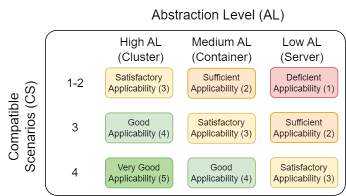
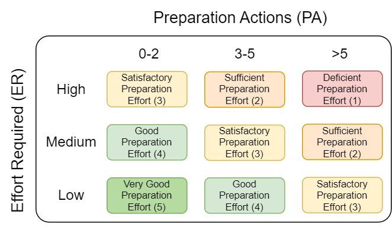
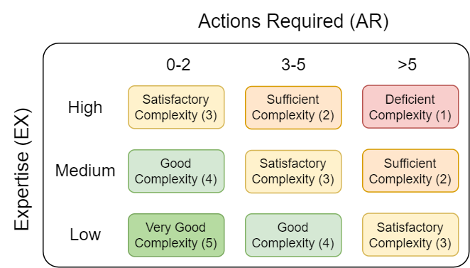
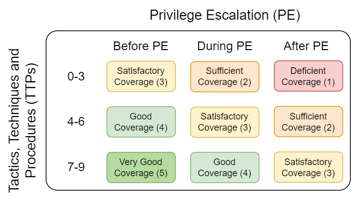
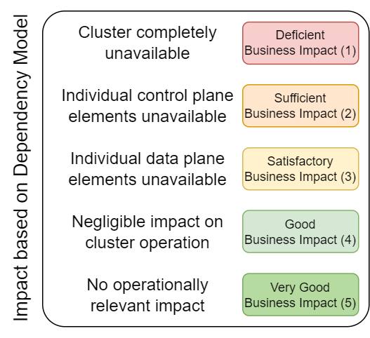
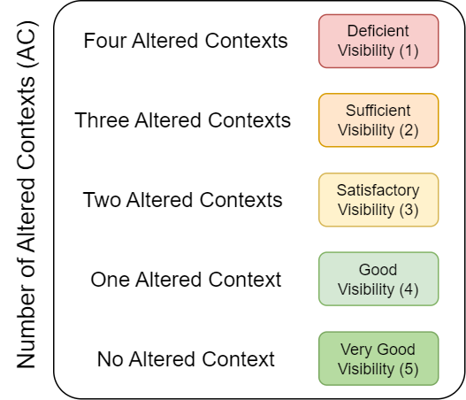
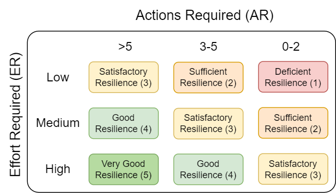
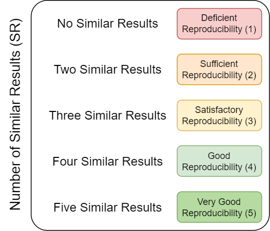
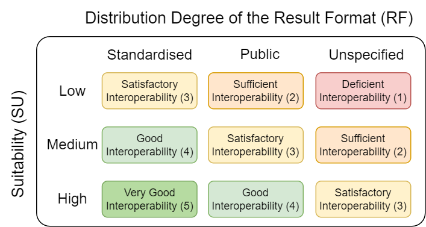

# Measures for Responding to Cryptojacking Attacks on Kubernetes

This directory contains detailed information about the measures proposed in the research paper "Responding to Cryptojacking Attacks on Kubernetes Using an Incident Response Playbook".
In addition to those details, this directory contains a comprehensive description describing the evaluation of each measure, including evidence and justification.
Furthermore, the following sections provide an overview of the structure and content of this folder, as well as a visual representation of the grading schemes, which are associated with the nine criteria that are used to evaluate each measure.

## Folder Structure

### Measures
The subdirectories [analysis_measures](./analysis_measures), [containment_measures](./containment_measures), [eradication_measures](./eradication_measures) and [recovery_measures](./recovery_measures) contain detailed information regarding the following measures and their evaluation:

- **analysis measures**
  - **file analysis measures**
    - A-F-01
    - A-F-02
  - **network analysis measures**
    - A-N-01
    - A-N-02
  - **process analysis measures**
    - A-P-01
    - A-P-02
    - A-P-03
- **containment measures**
  - **network isolation measures**
    - C-N-01
    - C-N-02
  - **process isolation measures**
    - C-P-01
    - C-P-02
- **eradication measures**
  - **access eradication measures**
    - E-A-01
    - E-A-02
  - **process eradication measures**
    - E-P-01
    - E-P-02
    - E-P-03
- **recovery measures**
  - **access recovery measures**
    - R-A-01
    - R-A-02
  - **object recovery measures**
    - R-O-01
    - R-O-02

## Visual Representation of Grading Schemes

The following sections contain a visual representation of the grading schemes, which are associated with the nine criteria that are used to evaluate each measure.
A detailed account of the methodology employed can be found in the research paper.

### C.1 Applicability

### C.2 Preparation Effort

### C.3 Complexity

### C.4 Coverage

### C.5 Business Impact

### C.6 Visibility

### C.7 Resilience

### C.8 Reproducibility

### C.9 Interoperability

