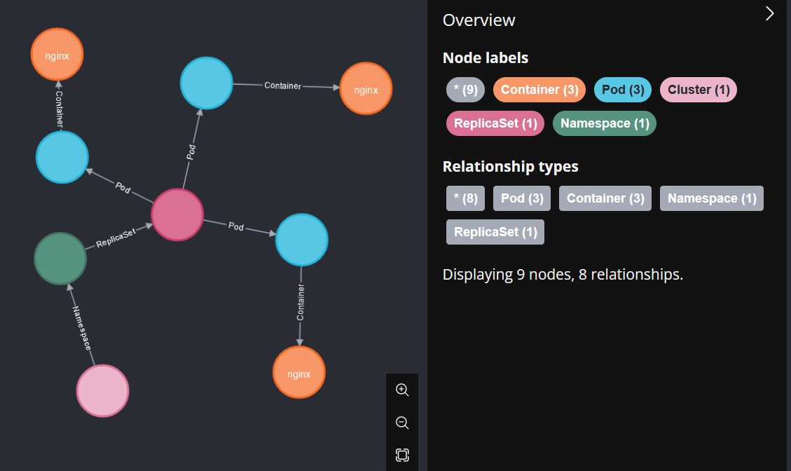

# A-N-01 Network Analysis by Creating a Cluster Overview

In general, a method for creating a cluster overview should be utilized to quickly identify all active elements of the cluster in the event of an emergency [[Joh22b](https://learning.oreilly.com/library/view/digital-forensics-and/9781803238678/)]. In the context of Kubernetes, there are various ways to get an overview of the cluster, such as manually executing individual commands to query the cluster status via the command-line interface [[The24p](https://kubernetes.io/docs/reference/kubectl/)]. Another option is to use the official Kubernetes Dashboard [[The22b](https://kubernetes.io/docs/tasks/access-application-cluster/web-ui-dashboard/)], which is also implemented in every test szenario on port 30443.

However, there are also alternative solutions to gain a visual overview of the cluster. For example, the command-line extension "kubectl graph" [[Teu24](https://github.com/steveteuber/kubectl-graph)] offers a flexible way to visualize various objects within a cluster in an organized manner [[Teu24](https://github.com/steveteuber/kubectl-graph)]. Three different output formats can be selected, some of which even allow for an interactive representation of the cluster's elements [[Teu24](https://github.com/steveteuber/kubectl-graph)]. Through integration with "Node4j" [[Neo24](https://neo4j.com/)], for instance, it is possible to create an interactive graph that displays all selected Kubernetes objects and their dependencies in a diagram [[Teu24](https://github.com/steveteuber/kubectl-graph)]. A specific example of this is shown in Figure 1.

##### Figure 1: Exemplary representation of pods and their dependencies in Node4j using kubectl graph according


It is also possible, however, to use "kubectl graph" and "Graphviz" [[The24m](https://graphviz.org/)] to create a simple SVG graphic of the Kubernetes objects and their dependencies, which can be used to visually persist the state of the cluster [[Teu24](https://github.com/steveteuber/kubectl-graph)]. The following precautions should be taken:

1. Installation of Krew, a tool for managing Kubernetes command-line interface extensions (see Listing 1 lines 1 to 8) [[The22d](https://krew.sigs.k8s.io/docs/user-guide/setup/install/);[Teu24](https://github.com/steveteuber/kubectl-graph)].
   - Krew is essentially a package manager, similar to Helm, used for managing various command-line interface extensions for kubectl [[The22d](https://krew.sigs.k8s.io/docs/user-guide/setup/install/)];.

2. Installation of the kubectl graph extension (see Listing 1 line 9 [[Teu24](https://github.com/steveteuber/kubectl-graph)]).
   - It should be noted that, unlike Krew, this extension is not maintained by the Kubernetes developer community but by individual developers. Therefore, the publicly available source code should be reviewed before using it in production environments [[Teu24](https://github.com/steveteuber/kubectl-graph);[The22d](https://krew.sigs.k8s.io/docs/user-guide/setup/install/)].

3. Installation of Graphviz (see Listing 1 line 10) [[Teu24](https://github.com/steveteuber/kubectl-graph);[The24m](https://graphviz.org/)].
   - Graphviz is visualization software that is required to convert the output of the kubectl extension into SVG format [[Teu24](https://github.com/steveteuber/kubectl-graph)].

Subsequently, a visual representation of all running pods in the cluster can be created using the command from line 11 in Listing 1.

##### Listing 1: Commands for creating an overview of the cluster by [[Teu24](https://github.com/steveteuber/kubectl-graph);[The24m](https://graphviz.org/)]

```bash
( set -x; cd "$(mktemp -d)" &&
OS="$(uname | tr '[:upper:]' '[:lower:]')" &&
ARCH="$(uname -m | sed -e 's/x86_64/amd64/' -e 's/\(arm\)\(64\)\?.*/\1\2/' -e 's/aarch64$/arm64/')" &&
KREW="krew-${OS}_${ARCH}" &&
curl -fsSLO "https://github.com/kubernetes-sigs/krew/releases/latest/download/${KREW}.tar.gz" &&
tar zxvf "${KREW}.tar.gz" &&
./"${KREW}" install krew )
export PATH="${KREW_ROOT:-$HOME/.krew}/bin:$PATH"
kubectl krew install graph
sudo apt-get install graphviz
kubectl graph pods --field-selector status.phase=Running --all-namespaces | dot -T svg -o ~/Downloads/pods.svg `\label{line:graph-run}`
```

## Evaluation

The following table, entitled '_Evaluation of measure A-N-01_', provides an overview of the evaluation of the aforementioned measure. The composition of the overall rating is then described in detail.

#### Table: Evaluation of A-N-01

| Criteria           | Result |
| ------------------ | ------ |
| Applicability      | 5      |
| Preparation Effort | 2      |
| Complexity         | 5      |
| Coverage           | 1      |
| Business Impact    | 5      |
| Visibility         | 5      |
| Resilience         | 5      |
| Reproducibility    | 5      |
| Interoperability   | 4      |
| Overall Rating     | 4,25   |

To evaluate this measure, several graphs were created reflecting the pods within the experimental environment. It became clear that as shown in Figure 2 the measure has no significant impact on the cluster or the operation of the active workloads within it. Therefore, both visibility and business impact are rated as very low (5).

At the same time, the applicability and reproducibility of the measure are very high (5), as it could be carried out in all test scenarios via the Kubernetes API, consistently producing identical results in each of the five executions. Additionally, the complexity of the measure is very low (5), as only one action is required to execute the measure in the event of an incident. However, the preparation effort for this measure is considered high (2), as some tools need to be installed beforehand, and it should be assessed in advance, especially in a production environment, to what extent these tools meet the security requirements of the respective organization.

Nevertheless, the measure demonstrates very high resilience (5), as it is conceivable that an attacker could compromise the source code of the extension and thereby prevent the measure from being executed. However, the attacker would need to deceive the individual developers and simultaneously remove older versions of the application. Moreover, the interoperability of the results is high (4), as the output formats of the tools are all publicly available and highly functional.

The only drawback is the very low coverage (1), as only the TTPs T1136 [[The23aw](https://attack.mitre.org/techniques/T1136/)] and T1496 [[The23bc](https://attack.mitre.org/techniques/T1496/)] can be detected through changes in the Kubernetes objects. Overall, a good overall rating (4.25) was assigned.

##### Figure 2: Business impact of measure A-N-01
