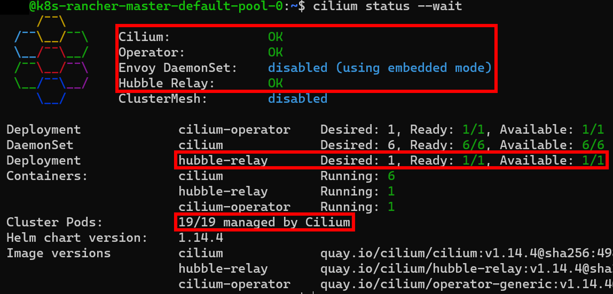

# A-N-02 Network Analysis by Capturing Network Packets

In addition to a general overview of the various pods in the cluster, it is also important in the context of network analysis to analyze individual network packets to assess the extent of the compromise and to identify the involved communication partners [[MPM14, p.221](http://cisweb.bristolcc.edu/~ik/Download/Forensic/Incident_Response_Computer_Forensics_3rd_Edition.pdf);[Joh22b](https://learning.oreilly.com/library/view/digital-forensics-and/9781803238678/);[Tho18, p.91ff.](https://link.springer.com/book/10.1007/978-1-4842-3870-7)]. To ensure comprehensive documentation of the analysis, it is necessary to first collect the relevant network packets and store them for later analysis [[MPM14, p.224](http://cisweb.bristolcc.edu/~ik/Download/Forensic/Incident_Response_Computer_Forensics_3rd_Edition.pdf)]. Essentially, two different approaches are used to store network packets [[MPM14, p.224](http://cisweb.bristolcc.edu/~ik/Download/Forensic/Incident_Response_Computer_Forensics_3rd_Edition.pdf);[Tho18, p.91ff.](https://link.springer.com/book/10.1007/978-1-4842-3870-7)].

On one hand, it is possible to store the entire network packets, allowing for subsequent analysis of communication partners and content [[MPM14, p.224](http://cisweb.bristolcc.edu/~ik/Download/Forensic/Incident_Response_Computer_Forensics_3rd_Edition.pdf)]. However, this approach is very costly on a larger scale, which is why often only relevant metadata from the "header" [[Tho18, p.91](https://link.springer.com/book/10.1007/978-1-4842-3870-7)] of the network packets is stored. This way, the sender and receiver can still be identified, but the content cannot be traced afterward [[Tho18, p.91f.](https://link.springer.com/book/10.1007/978-1-4842-3870-7);[MPM14, p.224](http://cisweb.bristolcc.edu/~ik/Download/Forensic/Incident_Response_Computer_Forensics_3rd_Edition.pdf)].

The tool tcpdump is often used for recording network packets, providing technical implementation options for both approaches, where the relevant network traffic can be narrowed down using various filters [[MPM14, 221ff.](http://cisweb.bristolcc.edu/~ik/Download/Forensic/Incident_Response_Computer_Forensics_3rd_Edition.pdf)]. In the context of Kubernetes, this tool can still be used by recording the corresponding part of the network traffic on each node of the cluster. However, this involves significant effort in larger clusters. Additionally, using tcpdump offers no way to identify the corresponding Kubernetes objects other than by IP address, as the tool cannot easily account for the relationships within the cluster [[The24g](https://docs.cilium.io/en/stable/overview/intro/)].

However, the previously mentioned CNI Cilium already offers a way to record the metadata of the entire network traffic within the cluster. Specifically, the tool "Hubble" [[The24k](https://docs.cilium.io/en/stable/gettingstarted/hubble_setup/)] was developed for this purpose, which, in conjunction with the "Hubble Relay" [[The24e](https://docs.cilium.io/en/stable/internals/hubble/)], allows the reading of all network packet headers in the cluster via a central interface without direct interaction with the nodes [[The24e](https://docs.cilium.io/en/stable/internals/hubble/)]. Although complete network packets cannot be stored, it is possible, similar to tcpdump, to investigate the contextual information of certain network activities through granular filters while taking into account the context of the involved Kubernetes objects [[The24f](https://docs.cilium.io/en/stable/gettingstarted/hubble_cli/#inspecting-the-cluster-s-network-traffic-with-hubble-relay)].

However, Hubble cannot be combined with other CNIs, which means that the use of Cilium as a CNI is indispensable for the central collection of network packets using Hubble [[The24i](https://docs.cilium.io/en/stable/installation/k8s-install-migration/)]. This means that clusters previously using another CNI must first undergo a CNI migration following the instructions in [[The24i](https://docs.cilium.io/en/stable/installation/k8s-install-migration/)], which may not be practical or technically feasible [[The24i](https://docs.cilium.io/en/stable/installation/k8s-install-migration/)]. Reasons for this include both the high effort involved and the impact on the cluster's availability, as well as potentially missing functionalities provided by the previously used CNI [[The24k](https://docs.cilium.io/en/stable/gettingstarted/hubble_setup/)].

Regardless, the installation of the command-line interfaces for Cilium and Hubble is required to carry out this measure, which can be done without difficulty using the instructions from [[The24c](https://docs.cilium.io/en/stable/network/kubernetes/concepts/)] and [[The24k](https://docs.cilium.io/en/stable/gettingstarted/hubble_setup/)].

The measure can then be carried out as follows:

1. Verify the functionality of Hubble (see Listing 1 line 1) [[The24k](https://docs.cilium.io/en/stable/gettingstarted/hubble_setup/)].
    - This action specifically checks whether all containers are managed by Cilium and if the Hubble Relay is operational [[The24k](https://docs.cilium.io/en/stable/gettingstarted/hubble_setup/)]. An example output to verify these two aspects is shown in Figure 1. If either aspect is not met, it can be corrected using the instructions in [[The24k](https://docs.cilium.io/en/stable/gettingstarted/hubble_setup/)].

2. Set up the necessary port forwarding for access to the Hubble interface (see Listing 1 line 2) [[The24k](https://docs.cilium.io/en/stable/gettingstarted/hubble_setup/)].
   - The port forwarding should be removed after successful network traffic analysis.

3. Capture network packets (see Listing 1 line 3) [[The24k](https://docs.cilium.io/en/stable/gettingstarted/hubble_setup/)].
    - As with tcpdump, a variety of filters can be used here, with line 3 exemplifying traffic filtered to a specific IP address.
    - Notably, it is possible to filter directly by individual namespaces, services, or pods without needing to know their specific network properties [[The24f](https://docs.cilium.io/en/stable/gettingstarted/hubble_cli/#inspecting-the-cluster-s-network-traffic-with-hubble-relay)].

##### Listing 1: Commands for network analysis using Hubble according to [[The24k](https://docs.cilium.io/en/stable/gettingstarted/hubble_setup/);[The24f](https://docs.cilium.io/en/stable/gettingstarted/hubble_cli/#inspecting-the-cluster-s-network-traffic-with-hubble-relay)]
```bash
cilium status --wait
cilium hubble port-forward&
hubble observe -f --ip <host-ip>
```

##### Figure 1: Example status message of Cilium


## Evaluation

The following table, entitled '_Evaluation of measure A-N-02_', provides an overview of the evaluation of the aforementioned measure. The composition of the overall rating is then described in detail.

#### Table: Evaluation of A-N-02

| Criteria           | Result |
| ------------------ | ------ |
| Applicability      | 3      |
| Preparation Effort | 4      |
| Complexity         | 3      |
| Coverage           | 5      |
| Business Impact    | 5      |
| Visibility         | 5      |
| Resilience         | 2      |
| Reproducibility    | 5      |
| Interoperability   | 5      |
| Overall Rating     | 4,00   |

For the reasons mentioned earlier, no migration of the respective CNIs was performed, and the measure was conducted based on the currently configured CNIs. Consequently, the measure demonstrates medium applicability (3), as network packets could only be successfully captured within the Rancher test scenario, although this is still possible centrally via the Kubernetes API or the Hubble interface.

Nevertheless, very high reproducibility (5) was observed, as the measure produced identical results in all five executions, with the call to the web server by the IP address ``172.25.252.58`` being captured in each case. If a complete migration of the CNI is not required, both business impact (shown in Figure 2) and visibility of this measure are rated as very low (5). The latter is based on the fact that the network packets are neither rerouted nor altered but are merely analyzed by Cilium using eBPF during forwarding [[The24g](https://docs.cilium.io/en/stable/overview/intro/)].

However, this measure can be bypassed with relatively little effort compared to others by using communication methods such as "DNS Tunneling" [[SRS20](https://ieeexplore.ieee.org/document/9112413)] to obfuscate network traffic, which is why the resilience is rated as sufficient (2). This is possible because Hubble is currently unable to inspect the full content of network packets, although corresponding features are already being developed [[The23b](https://docs.cilium.io/en/stable/community/roadmap/)].

At the same time, the measure exhibits medium complexity (3), as a total of three to four actions are required, and network traffic analysis indeed demands a deeper understanding of Kubernetes' internal processes. On the other hand, the preparation effort for the measure is low (4), as, besides installing the command-line interface for Hubble and Cilium, only the Hubble Relay needs to be activated, which does not require significant effort.

In contrast, the coverage of the measure is very high (5), as this measure can capture network traffic related to TTPs T1190 [[The23ax](https://attack.mitre.org/techniques/T1190/)], T1613 [[The23au](https://attack.mitre.org/techniques/T1613/)], T1068 [[The23ay](https://attack.mitre.org/techniques/T1068/)], T1069 [[The23ba](https://attack.mitre.org/techniques/T1069/)], T1136 [[The23aw](https://attack.mitre.org/techniques/T1136/)], T1070 [[The23az](https://attack.mitre.org/techniques/T1070/)], and T1496 [[The23bc](https://attack.mitre.org/techniques/T1496/)]

Moreover, the interoperability of the results is very high (5), as shown in [[Lew23](https://isovalent.com/blog/post/cilium-hubble-cheat-sheet-observability/)], various output formats can be selected, ranging from typical JSON formats to tabular representations, and the results can also be provided via OTLP [[The23bf](https://opentelemetry.io/docs/specs/otlp/)].

In summary, this resulted in a good overall rating (4.00).

##### Figure 2: Business impact of measure A-N-02
