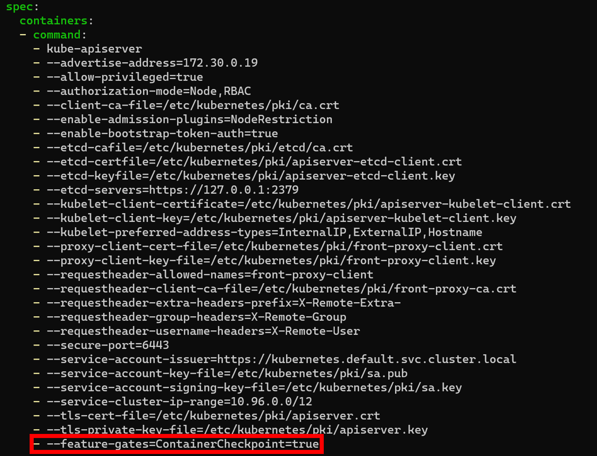
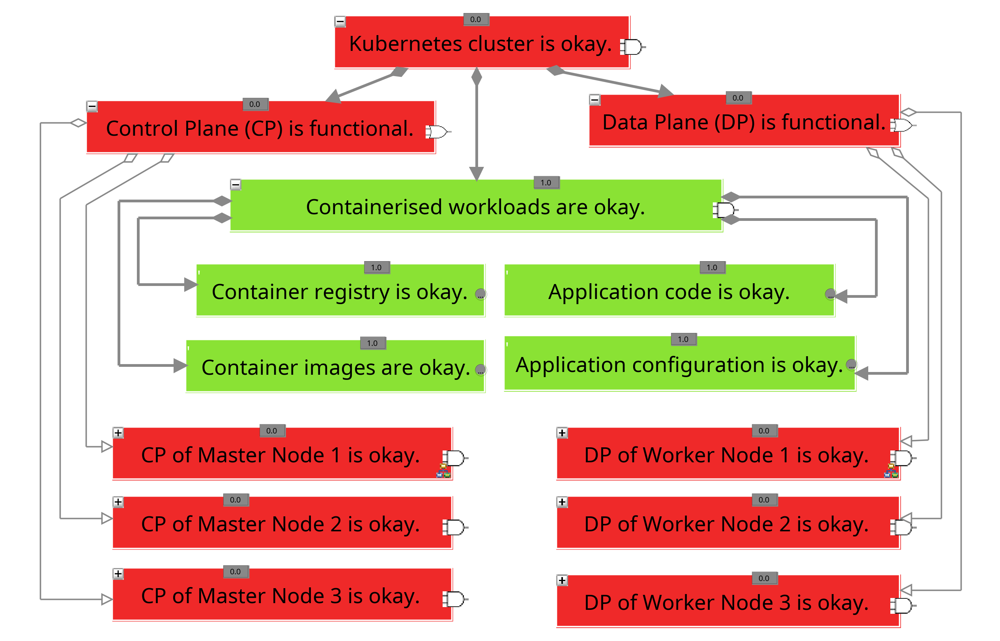

# A-P-01: Process analysis using forensic container image

In general, before taking any reactive measures that may affect the cluster, a complete (forensic) image of the components under investigation should be created to preserve the baseline for future analysis [[Int23](https://www.iso.org/standard/78973.html);[KW11](https://sansorg.egnyte.com/dl/6Btqoa63at)].
For both traditional and virtualised application environments, a number of tools and methodologies have been developed to provide a complete picture of the running systems [[MPM14](http://cisweb.bristolcc.edu/~ik/Download/Forensic/Incident_Response_Computer_Forensics_3rd_Edition.pdf);[Joh22c](https://learning.oreilly.com/library/view/digital-forensics-and/9781803238678/)].

In the context of the Kubernetes container orchestration platform, initial work has been done by Reber [[Reb22](https://kubernetes.io/blog/2022/12/05/forensic-container-checkpointing-alpha/)] in collaboration with Red Hat, Inc. to integrate a native capability to create forensic images of individual containers into Kubernetes [[Reb22](https://kubernetes.io/blog/2022/12/05/forensic-container-checkpointing-alpha/);[Reb23a](https://kubernetes.io/blog/2023/03/10/forensic-container-analysis/);[Reb23b](https://media.ccc.de/v/all-systems-go-2023-177-forensic-container-checkpointing-and-analysis)].
However, it is still in the prototype stage, so it can only be used with the CRI-O container runtime and certain kernel versions [[Reb22](https://kubernetes.io/blog/2022/12/05/forensic-container-checkpointing-alpha/);[Reb23a](https://kubernetes.io/blog/2023/03/10/forensic-container-analysis/);[Reb23b](https://media.ccc.de/v/all-systems-go-2023-177-forensic-container-checkpointing-and-analysis);[Ven19](https://github.com/checkpoint-restore/criu/issues/860)].
Furthermore, in order to use this functionality, so-called 'Feature-Gate' [[The23q](https://kubernetes.io/docs/reference/command-line-tools-reference/feature-gates/)] still need to be enabled, which requires most Kubernetes components to be reconfigured and the corresponding containers to be restarted [[Reb22](https://kubernetes.io/blog/2022/12/05/forensic-container-checkpointing-alpha/)].
However, it is not recommended to enable this feature gate generally, as the source code has not been sufficiently tested to ensure stable cluster operation [[Reb22](https://kubernetes.io/blog/2022/12/05/forensic-container-checkpointing-alpha/);[The23q](https://kubernetes.io/docs/reference/command-line-tools-reference/feature-gates/)].

Independently of Reber's approach, the "kube-forensics" project [[Kei23](https://github.com/keikoproj/kube-forensics)] for creating forensic container images was released some time ago, but has seen little development and lacks extensive documentation [[Kei23](https://github.com/keikoproj/kube-forensics)].
This project also only supports a limited number of container runtimes [[Gho19](https://github.com/keikoproj/kube-forensics/issues/16)], so it is not universally applicable.
In addition, cloud providers have already developed their own proprietary solutions for creating container images, which are usually implemented on top of "Volatility" [[The20](https://www.volatilityfoundation.org/)] and generally only create an image of the entire memory of the node [[Ama23a](https://aws.github.io/aws-eks-best-practices/security/docs/incidents/);[Hal23](https://engineering.atspotify.com/2023/06/analyzing-volatile-memory-on-a-google-kubernetes-engine-node/);[DGQ22](https://publications.waset.org/10012612/the-use-of-artificial-intelligence-in-digital-forensics-and-incident-response-in-a-constrained-environment);[Pol23](https://sansorg.egnyte.com/dl/j1w6HbBo1M)].
However, as discussed above, these will not be considered further here.

Regardless, once compatibility issues are resolved in the future, the following actions can be taken to create forensic images of compromised pods based on Reber's approach:

1. Configure the container runtime being used, if it is compatible [[Reb22](https://kubernetes.io/blog/2022/12/05/forensic-container-checkpointing-alpha/);[Reb23a](https://kubernetes.io/blog/2023/03/10/forensic-container-analysis/);[Reb23b](https://media.ccc.de/v/all-systems-go-2023-177-forensic-container-checkpointing-and-analysis)].
    - For example, necessary functions of the CRI-O container runtime can be enabled by line 1 in Listing 1.
2. Activate the feature gate by configuring the relevant Kubernetes components, such as the API server and Kubelet [[Reb22](https://kubernetes.io/blog/2022/12/05/forensic-container-checkpointing-alpha/);[Reb23a](https://kubernetes.io/blog/2023/03/10/forensic-container-analysis/);[Reb23b](https://media.ccc.de/v/all-systems-go-2023-177-forensic-container-checkpointing-and-analysis)].
   - An example configuration of the API server can be found in Figure 1.
3. Create a forensic container image by directly interacting with the local CRI [[Kub23i](https://github.com/kubernetes-sigs/cri-tools/blob/master/docs/crictl.md)].
   - Currently, it is not possible to create forensic container images through the Kubernetes-API. Instead, this must be done directly via the CRI using ``crictl`` (see Listing 1 line 2).
   - Since the CRI is only accessible locally, the command must be executed on the node where the container or pod is running.
   - As described in detail by [[Reb23a](https://kubernetes.io/blog/2023/03/10/forensic-container-analysis/)], tools like \texttt{checkpointctl} or ``crit`` can be used for further analysis of the active processes and their memory regions.
   - The compromised pod can be restored multiple times based on the forensic image in a dedicated analysis environment.

##### Listing 1: Commands for creating forensic container images according to [[Reb22](https://kubernetes.io/blog/2022/12/05/forensic-container-checkpointing-alpha/);[Kub23i](https://github.com/kubernetes-sigs/cri-tools/blob/master/docs/crictl.md)]

```bash
sudo sed -i.bak 's/# enable_criu_support = false/enable_criu_support = true/' /etc/crio/crio.conf
crictl checkpoint --export=/path/to/checkpoint.tar <container>
```

##### Figure 1: Feature gate configuration of the API server


## Evaluation

The following table, entitled '_Evaluation of measure A-P-01_', provides an overview of the evaluation of the aforementioned measure. The composition of the overall rating is then described in detail.

#### Table: Evaluation of A-P-01

| Criteria           | Result |
| ------------------ | ------ |
| Applicability      | 0      |
| Preparation Effort | 5      |
| Complexity         | 1      |
| Coverage           | 4      |
| Business Impact    | 1      |
| Visibility         | 1      |
| Resilience         | 1      |
| Reproducibility    | 0      |
| Interoperability   | 4      |
| Overall Rating     | 0,00   |

Overall, the measure was rated as inadequate (0) because it could not be successfully executed in any of the test scenarios, meaning its applicability and reproducibility are inadequate (0). This is due to the fact that the compatible container runtime CRI-O was implemented in only one of the four scenarios, and the kernel version (5.15) used in the experimental environment is not compatible with the measure [[Ven19](https://github.com/checkpoint-restore/criu/issues/860)]. Consequently, the measure also exhibits very low resilience (1) as no additional actions are necessary to bypass it.

Nevertheless, the measure requires very little preparation effort (5) since the function is directly integrated into Kubernetes and precautions such as enabling the feature gate in advance are not recommended. Conversely, the measure currently has a very high level of complexity (1) as various Kubernetes components need to be reconfigured, which involves a multitude of individual actions and requires a high level of knowledge in the field of Kubernetes. This reconfiguration of components, which is associated with a restart of the corresponding pods, also leads to a very high Business Impact (1) as, the entire cluster is affected by the measure (see Figure 2). At the same time, the measure has very high visibility (1) as the reconfiguration of components alters all contexts of the cluster and the compromised pod.

Aside from that, the measure has a high coverage (4) as it enables the storage of IoCs for the TTPs T1190 [[The23ax](https://attack.mitre.org/techniques/T1190/)], T1528
[[The23bd](https://attack.mitre.org/techniques/T1528/)], T1613 [[The23au](https://attack.mitre.org/techniques/T1613/)], T1069 [[The23ba](https://attack.mitre.org/techniques/T1069/)] und T1496 [[The23bc](https://attack.mitre.org/techniques/T1496/)], and prevents the future removal of traces left within a pod (T1070)  [[The23az](https://attack.mitre.org/techniques/T1070/)]. Furthermore, the measure exhibits high interoperability (4) as the forensic container images are generated in "Tar format" [[Fre23](https://www.gnu.org/software/tar/manual/html_node/Standard.html)] and can easily be transferred to a dedicated environment and converted into a binary memory image [[Reb23a](https://kubernetes.io/blog/2023/03/10/forensic-container-analysis/)], resulting in a high level of utility in the findings.

##### Figure 2: Business impact of measure A-P-01
