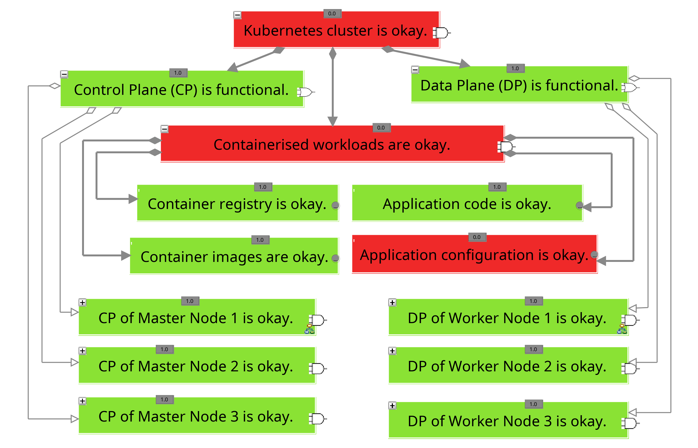

# C-N-01 Complete Network Isolation of Applications

The network isolation of compromised resources has long been an established measure to prevent the spread of cyberattacks within a network [[KW11, p.7f](https://sansorg.egnyte.com/dl/6Btqoa63at); [Tho18, p.100ff](https://link.springer.com/book/10.1007/978-1-4842-3870-7); [MPM14, p.613ff](http://cisweb.bristolcc.edu/~ik/Download/Forensic/Incident_Response_Computer_Forensics_3rd_Edition.pdf); [Joh22d](https://learning.oreilly.com/library/view/digital-forensics-and/9781803238678/)]. Traditionally, this involves simply disconnecting the physical network connection to the servers running the compromised applications [[MPM14, p.613ff](http://cisweb.bristolcc.edu/~ik/Download/Forensic/Incident_Response_Computer_Forensics_3rd_Edition.pdf)]. While this makes the affected application unavailable, it prevents the cyberattack from spreading to other applications, which remain fully operational.

With the increasing use of virtual machines (VMs) and containers, however, this simple disconnection of the physical network connection has a much greater impact on the affected organization, as multiple applications may become partially or fully unavailable, even though only one may be compromised.

As a result, new measures have been developed to enable more granular isolation of compromised VMs or containers [[Doc24b](https://docs.docker.com/engine/reference/commandline/network_disconnect/); [Bro21](https://docs.vmware.com/en/VMware-vSphere/7.0/com.vmware.vsphere.networking.doc/GUID-1A9F0D79-7A78-44D2-8401-33A004C384FB.html)]. These measures have also been extended to the context of container orchestration platforms like Kubernetes, where network policies are used to block network traffic for individual pods [[The23a](https://docs.cilium.io/en/stable/security/policy/#network-policy); [The24x](https://kubernetes.io/docs/concepts/services-networking/network-policies/); [Ama23a](https://aws.github.io/aws-eks-best-practices/security/docs/incidents/)].

These network policies are not enforced directly by the Kubernetes engine itself but are implemented by the network plugin in use, and the configuration options vary depending on the plugin [[The23a](https://docs.cilium.io/en/stable/security/policy/#network-policy); [The24x](https://kubernetes.io/docs/concepts/services-networking/network-policies/)].

The following section presents a concrete approach to fully isolating the network of selected pods, which is compatible with most network plugins:

1. Identification of suitable ``labels`` for the unique assignment of pods and services [[The23z](https://kubernetes.io/docs/concepts/overview/working-with-objects/labels/)].
   - Labels within Kubernetes provide a way to specify individual properties of a Kubernetes object using key-value pairs, allowing these objects to be selected and distinguished from each other [[The23z](https://kubernetes.io/docs/concepts/overview/working-with-objects/labels/)].
   - Specifically, any number of existing labels can be used to select the applications to be isolated, or new labels can be assigned, for example, with the command in Listing 1, line 1.

2. Configuration of complete network isolation for selected applications (see Listing 1, line 2) [[Ama23a](https://aws.github.io/aws-eks-best-practices/security/docs/incidents/); [The24x](https://kubernetes.io/docs/concepts/services-networking/network-policies/)].
   - The YAML configuration in Listing 2 can be used as a template for this purpose, where the namespace and corresponding label should be explicitly adjusted.
   - It is important to ensure that all Kubernetes objects related to the compromised application are selected through the corresponding labels.

##### Listing 1: Commands for complete network isolation of individual pods according to [[Ama23a](https://aws.github.io/aws-eks-best-practices/security/docs/incidents/); [The24x](https://kubernetes.io/docs/concepts/services-networking/network-policies/)]

```bash
kubectl label pod <pod-name> isolate=true
kubectl apply -f network_policy.yaml
```

##### Listing 2: YAML configuration for complete network isolation of an application according to [[Ama23a](https://aws.github.io/aws-eks-best-practices/security/docs/incidents/); [The24x](https://kubernetes.io/docs/concepts/services-networking/network-policies/)]

```bash
apiVersion: networking.k8s.io/v1
kind: NetworkPolicy
metadata:
    name: default-deny
spec:
    podSelector:
    matchLabels:
        app: nginx
    policyTypes:
    - Ingress
    - Egress
```

## Evaluation

The following table, entitled *Evaluation of measure C-N-01*, provides an overview of the evaluation of the aforementioned measure. The composition of the overall rating is then described in detail.

#### Table: Evaluation of C-N-01

| Criteria           | Result |
| ------------------ | ------ |
| Applicability      | 4      |
| Preparation Effort | 4      |
| Complexity         | 5      |
| Coverage           | 5      |
| Business Impact    | 1      |
| Visibility         | 1      |
| Resilience         | 2      |
| Reproducibility    | 5      |
| Interoperability   | N/A    |
| Overall Rating     | 3,32   |

To evaluate this measure, a network policy was created according to the aforementioned guidelines, which completely isolates the web server implemented in the experimental environment from the network. The next step was to check whether the web server was still accessible from the outside and whether a connection could be established from an associated web server pod to Google. The measure is considered successful only if both incoming and outgoing network traffic is blocked.

During the evaluation, it was found that the measure has a high coverage (4) as it was successfully implemented in three out of four test scenarios. It should be noted that in the Rancher test scenario, only outgoing network connections were blocked using the described procedure, and the web server could still be accessed within the cluster even after the network policy was activated. This issue was due to interactions between the hardening measures configured in Rancher and the additionally implemented network policy, which should be mitigated in the future by adjusting the YAML configuration.

This also indicates that the measure, in its presented form, can be easily bypassed if attackers configure a network policy allowing access to the respective application. To prevent this, the affected organization would need to take an additional step by removing all unnecessary network policies. Therefore, the resilience of the measure is rated as low (2).

At the same time, the reproducibility of the presented measure is very high (5), as identical results were produced in the five successful implementations. Additionally, the coverage of the measure is very high (5) since any interaction with the compromised pod over the network is effectively prevented. The preparation effort is low (4), as the application and all related Kubernetes objects should ideally be assigned unique labels in advance, which can be used in an emergency to fully isolate the network without affecting other applications due to incorrect label selection.

Furthermore, the complexity of the measure is very low (5) because only one or two actions need to be performed, which require minimal expertise. Nevertheless, the business impact of the measure is very high (1), as the entire compromised application is no longer accessible (see Figure 1). Therefore, according to Shaked et al., the entire cluster is considered non-functional. As a result, this measure can clearly be classified as a short-term containment measure, meaning it should not be used longer than necessary and should ideally be replaced by a long-term containment measure.

Consequently, the visibility of the measure is also very high (1), as although only the network context of the compromised pods has been changed, the business impact is already very high, making only a poor evaluation of visibility possible. Since the measure does not produce any further usable results, the interoperability of the results was not considered further. Overall, a total rating of 3.32 was given.

##### Listing 3: Commands for checking the network connection to the web server

```bash
curl -I http://localhost:30007 -m 5
kubectl exec <pod-name> -it -- curl -I http://www.google.com -m 5
```


##### Figure 1: Business impact of measure C-N-01
