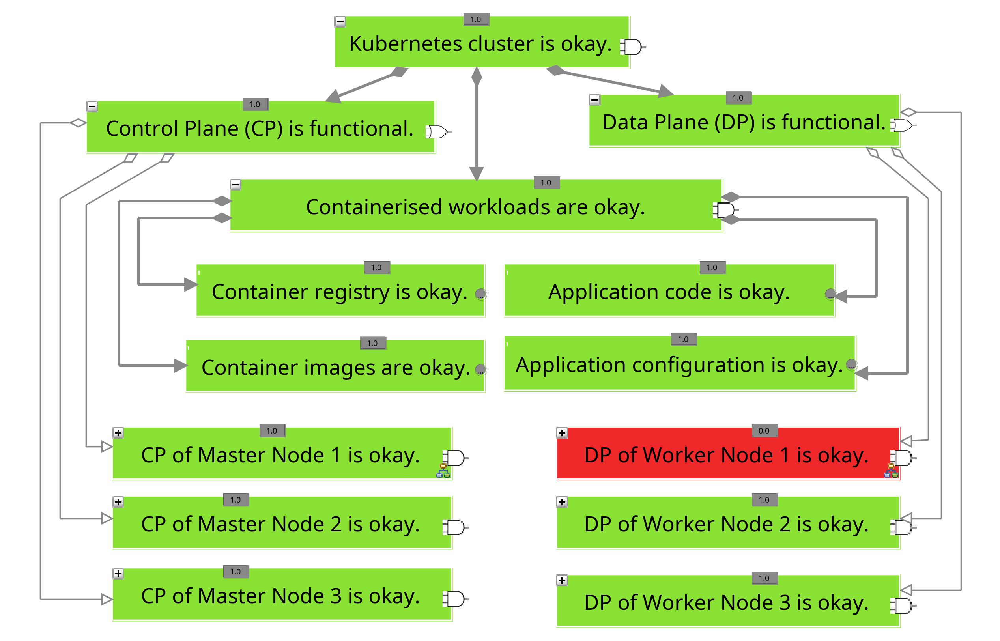

# C-P-01 Process Isolation by Blocking Nodes with Compromised Pods

As the risk of compromising the nodes hosting the infected pods cannot be completely excluded, precautions should be taken both to protect other applications on the same node from the harmful effects of further actions by the attackers, and to facilitate further incident analysis [[Ama23a](https://aws.github.io/aws-eks-best-practices/security/docs/incidents/); [Pol23](https://sansorg.egnyte.com/dl/j1w6HbBo1M); [Pel22](https://sysdig.com/blog/guide-kubernetes-forensics-dfir/)].

One option is to label the affected nodes with a label such as `infected=true`. However, this does not directly prevent additional pods from being scheduled on these nodes, as each application would need to be separately configured to ensure that its associated pods are only scheduled on nodes with the label `infected=false` [[Pel22](https://sysdig.com/blog/guide-kubernetes-forensics-dfir/); [The23p](https://kubernetes.io/docs/concepts/workloads/controllers/deployment/)]. Since this approach is both labor-intensive and prone to errors, an alternative is to cordon off compromised nodes. By cordoning, the scheduler no longer considers the affected nodes as part of the available resources, ensuring that they are ignored when selecting the optimal node for a pod [[Ama23a](https://aws.github.io/aws-eks-best-practices/security/docs/incidents/); [Pol23](https://sansorg.egnyte.com/dl/j1w6HbBo1M); [Pel22](https://sysdig.com/blog/guide-kubernetes-forensics-dfir/); [The23af](https://kubernetes.io/docs/concepts/architecture/nodes/)].

However, these precautions only prevent new pods from being placed on the node and do not move already running pods to other nodes [[The23af](https://kubernetes.io/docs/concepts/architecture/nodes/)]. At this point, it would be possible to use the integrated capability to drain the node, which moves all active pods to other nodes [[The23al](https://kubernetes.io/docs/tasks/administer-cluster/safely-drain-node/)]. However, this would also result in moving pods from compromised deployments to other nodes, which would not be beneficial for isolating the attack [[The23al](https://kubernetes.io/docs/tasks/administer-cluster/safely-drain-node/)].

Instead, all currently uncompromised applications with active pods on cordoned nodes should be systematically restarted so that their individual pods are gradually rescheduled by the scheduler [[The24v](https://kubernetes.io/docs/reference/kubectl/generated/kubectl_rollout/kubectl_rollout_restart/)].

The following outlines a procedure for cordoning nodes with compromised pods:

1. Identification of the nodes running compromised pods (see Listing 1 line 1) [[Ama23a](https://aws.github.io/aws-eks-best-practices/security/docs/incidents/); [Pol23](https://sansorg.egnyte.com/dl/j1w6HbBo1M); [Pel22](https://sysdig.com/blog/guide-kubernetes-forensics-dfir/)].
    - The command in line 1 must be executed for all compromised pods, or the respective nodes can be identified using other queries.

2. Cordon the affected nodes (see Listing 1 line 2) [[Ama23a](https://aws.github.io/aws-eks-best-practices/security/docs/incidents/); [Pol23](https://sansorg.egnyte.com/dl/j1w6HbBo1M); [Pel22](https://sysdig.com/blog/guide-kubernetes-forensics-dfir/)].
    - All affected nodes can be cordoned with a single command by listing the names of all nodes separated by spaces.

3. Identify applications with active pods on cordoned nodes (see Listing 1 line 3) [[Bae23](https://www.baeldung.com/ops/kubernetes-list-every-pod-node); [Ama23a](https://aws.github.io/aws-eks-best-practices/security/docs/incidents/)]; .
    - Alternatively, a command-line tool like `nerdctl` could be used to query the local container runtime of the nodes for additional pods, though this will not be explored further here.

4. Restart all applications with active pods on cordoned nodes (see Listing 1 line 4) [[The24v](https://kubernetes.io/docs/reference/kubectl/generated/kubectl_rollout/kubectl_rollout_restart/)].
    - Only applications that do not show any signs of compromise are meant here.
    - The command in line 4 applies only to applications based on deployments. StatefulSets and other resources should also be restarted similarly [[The23ar](https://kubernetes.io/docs/concepts/workloads/controllers/statefulset/)].

5. Check if any new pods have been placed on the cordoned nodes.
    - The command from line 3 can be repeated at this point.

##### Listing 1: Commands for locking nodes with compromised pods by [[Ama23a](https://aws.github.io/aws-eks-best-practices/security/docs/incidents/); [Pol23](https://sansorg.egnyte.com/dl/j1w6HbBo1M)]

```bash
kubectl get pods <podname> -n <namespace>  -o=jsonpath='{.spec.nodeName}{"\n"}'
kubectl cordon <Namen der betroffenen Nodes>
kubectl get pods --field-selector spec.nodeName=<node-name> -n <namespace>
kubectl rollout restart deployment <deployment-name>
```

## Evaluation

The following table, entitled *Evaluation of measure C-P-01*, provides an overview of the evaluation of the aforementioned measure. The composition of the overall rating is then described in detail.

#### Table: Evaluation of C-P-01

| Criteria           | Result |
| ------------------ | ------ |
| Applicability      | 5      |
| Preparation Effort | 5      |
| Complexity         | 3      |
| Coverage           | 1      |
| Business Impact    | 3      |
| Visibility         | 3      |
| Resilience         | 3      |
| Reproducibility    | 5      |
| Interoperability   | 4      |
| Overall Rating     | 3,65   |

To evaluate the effectiveness of this measure, the node running the cryptominer deployed by the attackers was identified following the aforementioned instructions. This node was then cordoned, and the remaining applications on that node were relocated to other nodes by restarting them. This procedure successfully isolated the cryptominer pod in all test scenarios while preventing the deployment of new pods by cordoning the affected nodes. With the ability to execute the entire process through the Kubernetes API, the measure demonstrates a very high applicability (5). Furthermore, the consistency of the results across all five executions indicates very high reproducibility (5).

Additionally, the interoperability of the results is high (4), as they can be output as typical command-line results or in YAML or JSON format for further processing.

Despite this, the preparation effort required for this measure is very low (5), as it can be fully implemented using native tools, except for an alternative method to identify active pods on the cordoned nodes. However, the coverage of the measure is considered inadequate (1), as the evaluation is based on the previously described attack scenario, where the expansion of the attack to other nodes was not considered. Although this risk cannot be ruled out in a real incident, the implementation still provides value for the affected organization.

The complexity of the measure is satisfactory (3), as it involves five actions, most of which require minimal expertise, except for identifying applications with active pods on cordoned nodes. The measure also has satisfactory resilience (3), as attackers who thoroughly investigate the security mechanisms of a Kubernetes cluster may still be able to compromise additional applications without immediate detection.

Additionally, both the business impact and visibility of the measure are at a satisfactory level (3), since the worker node is no longer available (see Figure 1), and both the network context and process context of the compromised pods are affected. The latter occurs because relocating the active pods to other nodes changes several network parameters, while the isolated cryptominer can exploit significantly more resources from the node.

However, given the negative impact on the organization's operations, this measure, with an overall score of 3.65, is classified as a short-term containment measure.

##### Figure 1: Business impact of measure C-P-01
