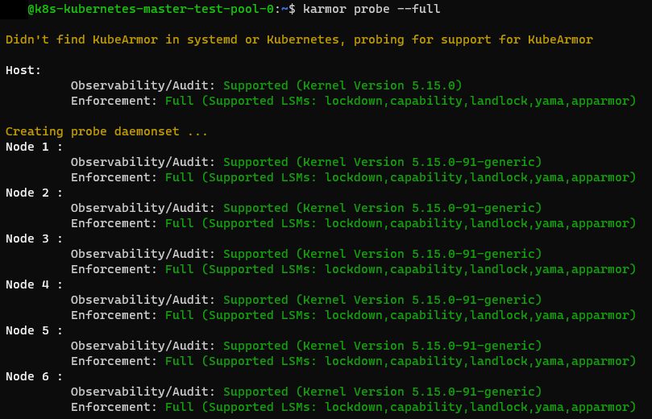

# C-P-02 Process Isolation by Blocking Unauthorized Processes

In typical Linux server environments, access control is centrally managed through Linux Security Modules (LSMs) [[The24n](https://www.kernel.org/doc/html/latest/admin-guide/LSM/index.html)], which complement the traditional access model based on the Discretionary Access Control (DAC) [[IBM21a](https://www.ibm.com/docs/en/zos/2.2.0?topic=controls-discretionary-access-control-dac)] of the Linux kernel with an implementation of Mandatory Access Control (MAC) [[IBM21b](https://www.ibm.com/docs/en/zos/2.2.0?topic=environment-mandatory-access-control-mac)] [[Red24a](https://access.redhat.com/documentation/en-us/red_hat_enterprise_linux/7/html/virtualization_security_guide/sect-virtualization_security_guide-svirt-mac); [App24](https://apparmor.net/); [Kub23b](https://docs.kubearmor.io/kubearmor/quick-links/differentiation)]. Specifically, an LSM like SELinux [[Red24a](https://access.redhat.com/documentation/en-us/red_hat_enterprise_linux/7/html/virtualization_security_guide/sect-virtualization_security_guide-svirt-mac)] or AppArmor [[App24](https://apparmor.net/)] enhances the user-based access control of the Linux kernel by enabling more granular regulation of file, process, and network access [[Red24a](https://access.redhat.com/documentation/en-us/red_hat_enterprise_linux/7/html/virtualization_security_guide/sect-virtualization_security_guide-svirt-mac); [App24](https://apparmor.net/)].

However, these must be configured separately on each node and do not offer direct integration with abstract Kubernetes objects, such as prohibiting access to a file within certain pods for specific users [[Kub24a](https://docs.kubearmor.io/kubearmor/documentation/faq); [The23h](https://kubernetes.io/docs/tasks/configure-pod-container/security-context/)]. While Kubernetes provides an integrated option to configure LSMs in the form of a PodSecurityContext [[The23h](https://kubernetes.io/docs/tasks/configure-pod-container/security-context/)], this only allows basic configurations and must be adapted for different LSMs in some cases [[The23h](https://kubernetes.io/docs/tasks/configure-pod-container/security-context/)].

To address this, the "KubeArmor" project [[Kub24c](https://kubearmor.io/)] and its tool aim to create a centralized configuration system that allows for defining granular rules for process execution, file access, and network usage [[Kub24c](https://kubearmor.io/); [Kub24b](https://docs.kubearmor.io/kubearmor/quick-links/deployment_guide)]. With this tool, it is possible to specify exactly which processes are allowed to run within a pod, without needing to modify the underlying container image or similar configurations [[Kub23b](https://docs.kubearmor.io/kubearmor/quick-links/differentiation)]. For example, the KubeArmorPolicy in Listing 2 prohibits the execution of all processes except for the command line (``bash``) and the web server (``nginx``) [[Kub24b](https://docs.kubearmor.io/kubearmor/quick-links/deployment_guide)]. Not only is execution blocked, but violations of the policy are also centrally logged, providing further insights for in-depth analysis.

The following steps outline the necessary actions to block all unauthorized processes using KubeArmor. As a precaution, KubeArmor can be pre-installed, but it should only be used to block processes in the event of an incident [[Kub23d](https://docs.kubearmor.io/kubearmor/use-cases/least_permissive_access); [Kub23g](https://docs.kubearmor.io/kubearmor/documentation/default_posture)]. This is because the project and its accompanying documentation are still in an early stage of development, and the active blocking of processes has not yet reached the maturity required for preventive use in a production environment [[Clo24a](https://www.cncf.io/projects/kubearmor/)]. The following preparatory actions are necessary:

1. Installation of the KubeArmor command-line interface (``karmor``) (see Listing 1 line 1) [[Kub24b](https://docs.kubearmor.io/kubearmor/quick-links/deployment_guide)].
     - Additionally, a namespace for KubeArmor should already be created (see Listing 1 line 2).

2. Compatibility check of all nodes with KubeArmor (see Listing 1 line 3)
     - This checks if a compatible LSM is active on all nodes and if a suitable kernel version is used.
     - An example of a successful compatibility check is shown in Figure 1.

3. Installation of KubeArmor in the Kubernetes cluster (see Listing 1 line 4) [[Kub24b](https://docs.kubearmor.io/kubearmor/quick-links/deployment_guide)].
     - Alternatively, KubeArmor can be installed via Helm, though this installation method is not discussed further here [[Kub24b](https://docs.kubearmor.io/kubearmor/quick-links/deployment_guide)].

After these preparations, it becomes possible to prevent the execution of specific processes. The full specification of configuration options can be found in KubeArmor’s official documentation [[Kub23f](https://docs.kubearmor.io/kubearmor/documentation/security_policy_specification)]. The following steps outline how to configure a KubeArmorPolicy:

1. Identify the labels and processes necessary for the proper functioning of the compromised application [[Kub24b](https://docs.kubearmor.io/kubearmor/quick-links/deployment_guide); [Kub23f](https://docs.kubearmor.io/kubearmor/documentation/security_policy_specification); [Kub23d](https://docs.kubearmor.io/kubearmor/use-cases/least_permissive_access)].
     - For example, as in measure A-P-02, an ephemeral container can be used to identify active processes within a pod (see Listing 1 line 5) and link these to the results of the process analysis.
     - It is again emphasized here that misconfiguration of the labels can significantly impair the effectiveness of the measure.

2. Configure a KubeArmorPolicy to block unauthorized processes within compromised pods (see Listing 1 lines 6 to 7) [[Kub24b](https://docs.kubearmor.io/kubearmor/quick-links/deployment_guide); [Kub23f](https://docs.kubearmor.io/kubearmor/documentation/security_policy_specification); [Kub23d](https://docs.kubearmor.io/kubearmor/use-cases/least_permissive_access)].
     - Specifically, one of the many templates from the KubeArmor documentation can be adapted to the relevant processes [[Kub23d](https://docs.kubearmor.io/kubearmor/use-cases/least_permissive_access); [Kub23a](https://docs.kubearmor.io/kubearmor/use-cases/use-cases)].
     - The command in line 6 ensures that violations of the KubeArmorPolicy in the respective namespace are not only reported but also blocked [[Kub24b](https://docs.kubearmor.io/kubearmor/quick-links/deployment_guide)].

3. Test the functionality of the KubeArmorPolicy (see Listing 1 line 8) [[Kub24b](https://docs.kubearmor.io/kubearmor/quick-links/deployment_guide)].
     - Try to execute any program within the pod that has not been explicitly allowed to verify if the execution is successfully blocked.
     - KubeArmor logs can be viewed using the command in line 9.

###### Listing 1: Commands for blocking unauthorised processes within pods according to [[Kub24b](https://docs.kubearmor.io/kubearmor/quick-links/deployment_guide); [Kub23a](https://docs.kubearmor.io/kubearmor/use-cases/use-cases); [Kub23d](https://docs.kubearmor.io/kubearmor/use-cases/least_permissive_access)]

```bash
curl -sfL http://get.kubearmor.io/ | sudo sh -s -- -b /usr/local/bin
kubectl create ns kubearmor
karmor probe --full
karmor install
kubectl debug <pod-name> -it --image ubuntu --share-processes --copy-to debug -c debugger -- ps aux
kubectl annotate ns <namespace> kubearmor-file-posture=block --overwrite
kubectl apply -f KubeArmorPolicy.yaml
kubectl exec -it <pod-name> -- bash -c "chroot"
karmor logs -n <namespace>
```

###### Listing 2: YAML configuration for process isolation according to [[Kub24b](https://docs.kubearmor.io/kubearmor/quick-links/deployment_guide)]

```bash
apiVersion: security.kubearmor.com/v1
kind: KubeArmorPolicy
metadata:
  name: only-allow-nginx-exec
spec:
  selector:
    matchLabels:
      app: nginx
  file:
    matchDirectories:
    - dir: /
      recursive: true
  process:
    matchPaths:
    - path: /usr/sbin/nginx
    - path: /bin/bash
  action:
    Allow
```
##### Figure 1: Command line output of the compatibility check for KubeArmor using karmor


## Evaluation

The following table, entitled *Evaluation of measure C-P-02*, provides an overview of the evaluation of the aforementioned measure. The composition of the overall rating is then described in detail.

#### Table: Evaluation of C-P-02

| Criteria           | Result |
| ------------------ | ------ |
| Applicability      | 4      |
| Preparation Effort | 4      |
| Complexity         | 2      |
| Coverage           | 4      |
| Business Impact    | 5      |
| Visibility         | 2      |
| Resilience         | 2      |
| Reproducibility    | 5      |
| Interoperability   | 5      |
| Overall Rating     | 3,85   |

As with the other measures previously discussed, this measure was evaluated following the procedure outlined in the previous section. KubeArmor was installed, the KubeArmorPolicy shown in Listing 2 was configured, and the features of KubeArmor were verified. It was found that the applicability of the measure is high (4), as it was successfully executed in three of the four test scenarios, and all actions could be performed through a central interface. The measure was not applicable in the Rancher context because the pods used by KubeArmor to configure the LSMs require specific permissions that are not easily compatible with the applied hardening measures.

Despite this, all test scenarios are supported according to KubeArmor's official documentation [[Kub23h](https://docs.kubearmor.io/kubearmor/quick-links/support_matrix)], which is reflected in the reproducibility of the measure, as a very high reproducibility (5) was demonstrated. Additionally, the results show very high interoperability (5), as they can be output as free-text, JSON, or based on the OpenTelemetry Protocol (OTLP) for further processing [[Kub23c](https://docs.kubearmor.io/kubearmor/documentation/kubearmor-events)].

Moreover, the measure offers a high coverage (4), as attackers can potentially be prevented from executing subsequent TTPs (Tactics, Techniques, and Procedures), depending on the implementation: T1190 [[The23ax](https://attack.mitre.org/techniques/T1190/)], T1528 [[The23bd](https://attack.mitre.org/techniques/T1528/)], T1613 [[The23au](https://attack.mitre.org/techniques/T1613/)], T1069 [[The23ba](https://attack.mitre.org/techniques/T1069/)], and T1496 [[The23bc](https://attack.mitre.org/techniques/T1496/)]. However, the complexity of the measure is also high, though only rated as sufficient (2), as the identification of necessary processes requires significant expertise [[Kub23d](https://docs.kubearmor.io/kubearmor/use-cases/least_permissive_access)].

On the other hand, the preparation effort for the measure is low (4), as a total of three actions with minimal effort are required to install the command-line tool ``karmor`` and implement KubeArmor in the cluster [[Kub24b](https://docs.kubearmor.io/kubearmor/quick-links/deployment_guide)]. However, the measure has low resilience (2), as attackers could detect the use of KubeArmor beforehand and configure their own KubeArmorPolicy to maintain their capabilities. To prevent this, a step for reviewing existing policies would need to be added to the procedure.

Nonetheless, the business impact of the measure is very low (5), as long as the necessary labels and processes are correctly configured; otherwise, other applications could fail unintentionally. The visibility of the measure is, however, at a high level (2), as the KubeArmorPolicy presented here primarily affects the process context of a compromised pod, though this configuration can also be used to restrict network and file access granularly [[Kub23a](https://docs.kubearmor.io/kubearmor/use-cases/use-cases)].

Despite this, due to its very low business impact, the measure can be classified as a long-term containment measure, with an overall rating of 3.85.

##### Figure 2: Business impact of measure C-P-02
