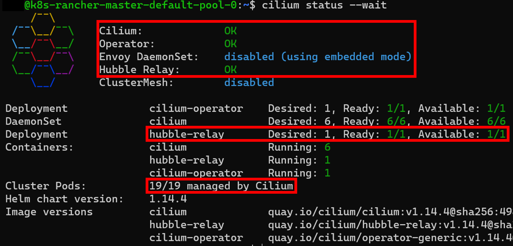

# R-A-01 Access Recovery by Restoring Network Access

As part of incident containment, a complete network isolation of compromised systems is often carried out to prevent the further spread of the incident. In traditional application environments, physical network connections are disconnected, which then need to be reconnected during the recovery phase [[Joh22d](https://learning.oreilly.com/library/view/digital-forensics-and/9781803238678/)]. In this context, it is recommended to implement additional security measures in case any remaining compromise is detected when restoring the network connection [[MPM14, p.620ff](http://cisweb.bristolcc.edu/~ik/Download/Forensic/Incident_Response_Computer_Forensics_3rd_Edition.pdf)]. Specifically, it is advised to implement deep network segmentation using "Virtual Local Area Networks" (VLANs) [[Joh22d](https://learning.oreilly.com/library/view/digital-forensics-and/9781803238678/)] to isolate individual servers as much as possible and thus prevent potential spread during recovery [[Joh22d](https://learning.oreilly.com/library/view/digital-forensics-and/9781803238678/)]. However, this VLAN separation is not possible in the context of Kubernetes, as a constant connection between all nodes in a cluster is necessary to maintain the operation of the container orchestration platform [[The23ap](https://kubernetes.io/docs/concepts/services-networking/)]. For this reason, any pod in the cluster can initially establish connections to all other services or pods without issue [[The23ap](https://kubernetes.io/docs/concepts/services-networking/)], which fundamentally allows for the spread of an incident. However, these open communication paths can be restricted through the use of network policies, as previously discussed in the measures for network isolation. Once all artifacts of the incident have been successfully removed, the network isolation of an application can be lifted while still preventing communication between the individual applications to ensure network isolation among them [[The18](https://cilium.io/blog/2018/09/19/kubernetes-network-policies/)]. The following procedure describes how to restore network access to the isolated application while implementing VLAN-like network isolation within a Kubernetes cluster. Specifically, communication between individual namespaces is blocked using Cilium, except for necessary exceptions [[The18](https://cilium.io/blog/2018/09/19/kubernetes-network-policies/)]. As part of the preparations, the command-line interface for Cilium should be installed according to the instructions in [[The24c](https://docs.cilium.io/en/stable/network/kubernetes/concepts/)].

1. Verify Cilium functionality (see Listing 1 line 1) [[The24c](https://docs.cilium.io/en/stable/network/kubernetes/concepts/)].
   - This step checks whether Cilium is functioning properly and if all containers are being managed by Cilium [[The24c](https://docs.cilium.io/en/stable/network/kubernetes/concepts/)]. An example of the output verifying these aspects is provided in Figure 1.

2. Configure the CiliumNetworkPolicy for relevant namespaces (see Listing 1 line 2) [[The23a](https://docs.cilium.io/en/stable/security/policy/#network-policy); [The18](https://cilium.io/blog/2018/09/19/kubernetes-network-policies/)].
   - It is necessary to configure the CiliumNetworkPolicy for each namespace whose applications need protection, as outlined in Listing 2. Additionally, the network policies contained within must be adjusted to allow for any required incoming and outgoing connections.

3. Lift the previous network isolation (see Listing 1 line 3) [[The24u](https://kubernetes.io/docs/reference/kubectl/quick-reference/)].
   - This step lifts the network isolation for the isolated applications. At the same time, monitoring measures should be implemented [[Joh22d](https://learning.oreilly.com/library/view/digital-forensics-and/9781803238678/)], the detailed description of which is beyond the scope of this work, but the work of Watts et al. [[Wat+21](http://hdl.handle.net/10125/71457)] can be used as a reference.

4. Verify network isolation between namespaces (see Listing 1 line 4).
   - This step checks if communication between applications is still possible. If it is, the CiliumNetworkPolicy configuration should be reviewed to ensure it is correct, and other network policies allowing traffic between the applications should be examined.

##### Listing 1: Commands for restoring network access to isolated applications according to [[The18](https://cilium.io/blog/2018/09/19/kubernetes-network-policies/); [Joh22d](https://learning.oreilly.com/library/view/digital-forensics-and/9781803238678/)]

```bash
cilium status --wait --wait-duration 5s
kubectl apply -f CiliumNetworkPolicy.yaml
kubectl delete networkpolicies.networking.k8s.io <networkpolicy-name>
kubectl exec -n <namespace> <pod-name> -it -- wget --timeout=5 --spider <service>.<namespace>.svc.cluster.local
```

##### Listing 2: YAML configuration for network-side isolation of namespaces according to [[The18](https://cilium.io/blog/2018/09/19/kubernetes-network-policies/)]
```bash
apiVersion: "cilium.io/v2"
kind: CiliumNetworkPolicy
metadata:
  name: "allow-within-namespace-<namespace>"
specs:
  - endpointSelector:
      matchLabels: {}
    egress:
    - toEndpoints:
      - matchLabels:
          "k8s:io.kubernetes.pod.namespace": <namespace>
    ingress:
    - fromEndpoints:
      - matchLabels:
          "k8s:io.kubernetes.pod.namespace": <namespace>
  - endpointSelector:
      matchLabels: {}
    egress:
    - toEndpoints:
      - matchLabels:
          "k8s:io.kubernetes.pod.namespace": kube-system
          "k8s:k8s-app": kube-dns
```

##### Figure 1: Example status message of Cilium



## Evaluation

The following table, entitled *Evaluation of measure R-A-01*, provides an overview of the evaluation of the aforementioned measure. The composition of the overall rating is then described in detail.

#### Table: Evaluation of R-A-01

| Criteria           | Result |
| ------------------ | ------ |
| Applicability      | 3      |
| Preparation Effort | 4      |
| Complexity         |  3     |
| Coverage           |  5     |
| Business Impact    |  5     |
| Visibility         |  4     |
| Resilience         |  2     |
| Reproducibility    |  5     |
| Interoperability   |  2     |
| Overall Rating     | 3,80   |

To evaluate this measure, a full network isolation of the web server was first carried out based on measure [C-N-01](/measures/containment_measures/network_isolation_measures/C-N-01/), followed by the procedure. As part of this process, the CiliumNetworkPolicy from Listing 2 was configured for all applications in the cluster, and the previously established network policy for full network isolation was removed. Subsequently, the network connection between the applications was tested according to the requirements of the measure. A moderate applicability (3) was identified, as the measure could only be successfully implemented in the Rancher test scenario. At the same time, the reproducibility of this measure is very high (5), as identical results were achieved in all cases. The preparatory effort for the measure is low (4), as the Cilium command-line interface only needs to be installed in advance and the relevant namespaces for the applications must be identified. The resilience (2) of this measure is also low, as attackers can still establish a connection between the applications by configuring an additional network policy, should there be an undetected compromise of other applications. Similarly, the interoperability of the achieved results is low (2), as the connection check using ``wget`` only supports a text-based command-line output, which cannot be easily converted into typical formats such as YAML or JSON [[Fre21](https://www.gnu.org/software/wget/manual/wget.html)].

Aside from that, the complexity of the measure is satisfactory (3), as four actions in total are required to implement it, and the actions generally require intermediate technical knowledge. The configuration of the CiliumNetworkPolicy, in particular, can pose a technical challenge. Moreover, the coverage of this measure is very high (5), as it can prevent the following TTPs: T1613 [[The23au](https://attack.mitre.org/techniques/T1613/)], T1069 [[The23ba](https://attack.mitre.org/techniques/T1069/)], T1136 [[The23aw](https://attack.mitre.org/techniques/T1136/)], T1068 [[The23ay](https://attack.mitre.org/techniques/T1068/)], T1070 [[The23az](https://attack.mitre.org/techniques/T1070/)], and T1496 [[The23bc](https://attack.mitre.org/techniques/T1496/)]. At the same time, the business impact of this measure is very low (5), as no additional operational restrictions are associated with the measure. Instead, it allows the resumption of interaction with previously isolated applications. Accordingly, the visibility of the measure is low (4), as the network context of the previously compromised application is altered. Overall, the measure is rated 3.80.


##### Figure 1: Business impact of measure R-A-01
