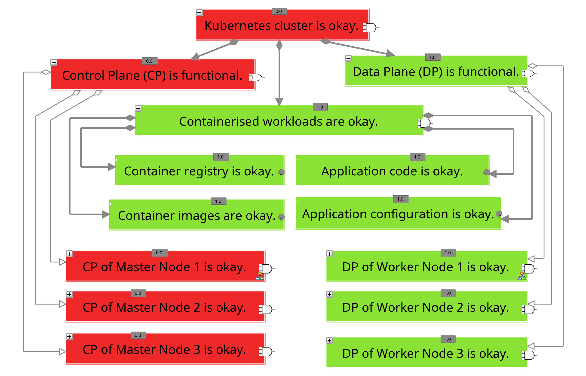

# R-O-01 Object Recovery by Restoring the Key Value Store

For various reasons, it is sometimes not possible to accurately determine which components of a Kubernetes cluster have been compromised, making a complete rebuild of the environment from scratch advisable in such cases [[Cic+12, p. 37](https://nvlpubs.nist.gov/nistpubs/SpecialPublications/NIST.SP.800-61r2.pdf); [MPM14, p. 623f](http://cisweb.bristolcc.edu/~ik/Download/Forensic/Incident_Response_Computer_Forensics_3rd_Edition.pdf)]. In the attack scenario under consideration, the compromised cluster can initially continue to operate as a mid-term solution to avoid a total outage of the applications running on it. While monitoring and cleaning the compromised cluster, work on setting up a second Kubernetes cluster can begin, which will fully replace the compromised cluster during the recovery phase. However, since this involves building a second production environment, alternatively, the compromised cluster could be rebuilt, though this would involve downtime.

It is highly beneficial if the configuration of the cluster does not need to be completely redefined, but can be restored from a backup of the key value store from before the incident. However, this is only advisable if the backup was created at a time when a compromise of the cluster can be explicitly ruled out [[MPM14, p. 623f](http://cisweb.bristolcc.edu/~ik/Download/Forensic/Incident_Response_Computer_Forensics_3rd_Edition.pdf)]. Furthermore, once the new Kubernetes cluster has been fundamentally set up, all measures to secure the cluster should be implemented before it is put back into operation [[Cic+12, p. 37](https://nvlpubs.nist.gov/nistpubs/SpecialPublications/NIST.SP.800-61r2.pdf)].

The following procedure can be used to restore the original configuration of a Kubernetes cluster in the context of an already fundamentally set up cluster using a backup of the etcd component. As part of the preparations, the ``etcdctl`` command-line tool can be installed to directly interact with the etcd cluster following the guidelines in [[etc23b](https://etcd.io/docs/v3.5/install/)]. Additionally, regular backups of the key value store should be performed according to the guidelines in [[The23ag](https://kubernetes.io/docs/tasks/administer-cluster/configure-upgrade-etcd/)] to generally enable configuration restoration [[The23ag](https://kubernetes.io/docs/tasks/administer-cluster/configure-upgrade-etcd/)]. As with measure [A-F-01](/measures/analysis_measures/file_analysis_measures/A-F-01/), it is important to note that the etcd cluster is not necessarily operated on the same nodes as the Kubernetes cluster, so the correct IP addresses must be provided during the restoration process.

1. Identification of the nodes in the etcd cluster (see Listing 1 line 1) [[Bil23](https://medium.com/@murat.bilal/backup-and-restore-on-kubernetes-ha-cluster-040b089f7a76); [The23ag](https://kubernetes.io/docs/tasks/administer-cluster/configure-upgrade-etcd/)].
   - This step is optional and can be used to identify all nodes in the etcd cluster if they differ from the nodes of the Kubernetes cluster.

2. Transfer of the backup to all nodes in the etcd cluster (see Listing 1 line 2) [[Bil23](https://medium.com/@murat.bilal/backup-and-restore-on-kubernetes-ha-cluster-040b089f7a76); [The23ag](https://kubernetes.io/docs/tasks/administer-cluster/configure-upgrade-etcd/)].
   - The tool `scp` [[SSH23](https://www.ssh.com/academy/ssh/scp)] is used here to transfer the backup copies to the individual nodes via the SSH protocol. Depending on the infrastructure platform used, other methods for transferring the backups can also be used, which are not described here in detail.

3. Restoration of the local state files on each node (see Listing 1 line 3) [[Bil23](https://medium.com/@murat.bilal/backup-and-restore-on-kubernetes-ha-cluster-040b089f7a76); [The23ag](https://kubernetes.io/docs/tasks/administer-cluster/configure-upgrade-etcd/)].
   - The command in line 3 must be executed individually on each node in the etcd cluster to restore the local cluster data there. It is crucial that the command is explicitly adjusted for each node to correctly restore the respective etcd node configuration.

4. Deactivation of the etcd cluster and the control plane (see Listing 1 line 4) [[Bil23](https://medium.com/@murat.bilal/backup-and-restore-on-kubernetes-ha-cluster-040b089f7a76); [The23ag](https://kubernetes.io/docs/tasks/administer-cluster/configure-upgrade-etcd/)].
   - To restore the backup, the control plane of the Kubernetes cluster, including the etcd cluster, must be deactivated [[The23ag](https://kubernetes.io/docs/tasks/administer-cluster/configure-upgrade-etcd/)]. If the restoration is carried out in the compromised cluster, this will lead to outages in the control plane, but it does not necessarily result in the failure of the applications running on it [[The23ag](https://kubernetes.io/docs/tasks/administer-cluster/configure-upgrade-etcd/)].
   - The command in line 4 must be executed on each master node of the Kubernetes cluster in the case of a stacked etcd component. This will make the static container definitions for the kubelet no longer visible, causing the kubelet to deactivate the control plane.

5. Update of the etcd configuration (see Listing 1 line 5) [[Bil23](https://medium.com/@murat.bilal/backup-and-restore-on-kubernetes-ha-cluster-040b089f7a76); [The23ag](https://kubernetes.io/docs/tasks/administer-cluster/configure-upgrade-etcd/)].
   - In this step, the configuration of the local etcd instance on each node is adjusted to use the cluster data restored from the backup in the future. For example, the command in line 5 can be used to update the referenced storage location.

6. Activation of the etcd cluster and the control plane (see Listing 1 line 6) [[Bil23](https://medium.com/@murat.bilal/backup-and-restore-on-kubernetes-ha-cluster-040b089f7a76); [The23ag](https://kubernetes.io/docs/tasks/administer-cluster/configure-upgrade-etcd/)].
   - The control plane and the etcd cluster can then be restarted. In the case of a stacked etcd component, it is sufficient to execute the command from line 6 on each master node of the Kubernetes cluster. If it is an external etcd component, the corresponding etcd instances must be additionally activated.

7. Verification of successful restoration (see Listing 1 line 7) [[Bil23](https://medium.com/@murat.bilal/backup-and-restore-on-kubernetes-ha-cluster-040b089f7a76); [The23ag](https://kubernetes.io/docs/tasks/administer-cluster/configure-upgrade-etcd/)].
   - First, it should be checked whether the Kubernetes API is accessible again, and then verified if the original configuration has been successfully restored.
   - Subsequently, the documented measures for securing the cluster should be implemented to prevent the cluster from being compromised again [[Cic+12, p.37]((https://nvlpubs.nist.gov/nistpubs/SpecialPublications/NIST.SP.800-61r2.pdf)); [Rah+23](https://dl.acm.org/doi/10.1145/3579639)].

##### Listing 1: Commands for restoring the Key Value Store according to [[Bil23](https://medium.com/@murat.bilal/backup-and-restore-on-kubernetes-ha-cluster-040b089f7a76); [The23ag](https://kubernetes.io/docs/tasks/administer-cluster/configure-upgrade-etcd/)]

```bash
sudo ETCDCTL_API=3 etcdctl --endpoints localhost:2379 --cacert=<Path to the certificate of the CA> --cert=<Path to the certificate of the etcd container> --key=<Path to the key of the etcd container> member list
scp <Path to the backup> <user>@<node-ip>:/tmp/etcdbackup
sudo ETCDCTL_API=3 etcdctl snapshot restore /tmp/etcdbackup --name <name-controller> --initial-cluster <name-controller1>=https://<ip-controller1>:2380,<name-controller2>=https://<ip-controller2>:2380,<name-controller3>=https://<ip-controller3>:2380 --data-dir /var/lib/etcd-new --initial-advertise-peer-urls https://<ip-controller>:2380 --cacert=<Path to the certificate of the CA> --cert=<Path to the certificate of the etcd container> --key=<Path to the key of the etcd container>
sudo mkdir <Path to the copy of the manifest> && sudo mv <Path to the Kubernetes manifest>* <Path to the copy of the manifest>
sudo sed -i ’s/path: \/var\/lib\/etcd/path: \/var\/lib\/etcd-new/’ <Path to the copy of the manifest>/etcd.yaml
sudo mv <Path to the copy of the manifest>* <Path to the Kubernetes manifest>
kubectl get pods
```

## Evaluation

The following table, entitled *Evaluation of measure R-O-01*, provides an overview of the evaluation of the aforementioned measure. The composition of the overall rating is then described in detail.

#### Table: Evaluation of R-O-01

| Criteria           | Result |
| ------------------ | ------ |
| Applicability      | 1      |
| Preparation Effort | 5      |
| Complexity         | 2      |
| Coverage           | 3      |
| Business Impact    | 1      |
| Visibility         | 1      |
| Resilience         | 5      |
| Reproducibility    | 5      |
| Interoperability   | 4      |
| Overall Rating     | 2,65   |

To evaluate the measure, it was carried out in the experimental environment according to the aforementioned specifications. During the preparation phase, ``etcdctl`` was installed, and a backup of the etcd component was created. Additionally, after creating the backup, another container was added during the implementation to later verify whether the restoration of the key value store was successful, meaning that the container would no longer be present in the cluster. In this process, it was found that the measure has very low applicability (1), as it was successfully performed in only two out of the four test scenarios using the outlined approach, and each node of the etcd cluster needs to be explicitly configured [[The24u](https://kubernetes.io/docs/reference/kubectl/quick-reference/); [The23ao](https://kubernetes.io/docs/concepts/security/service-accounts/)]. The measure could not be carried out in the context of K3s and Rancher, as the key value store used by K3s, SQLite, is not compatible with the outlined approach [[K3s24a](https://docs.k3s.io/datastore)], and an alternative method for restoring the etcd components is required in the Rancher test scenario. Nevertheless, the measure exhibits very high reproducibility (5), as identical results were achieved in every successful execution, and it also has high interoperability (4) since the results can be output in both text and YAML formats [[The24u](https://kubernetes.io/docs/reference/kubectl/quick-reference/)], both of which are highly functional.

Moreover, the preparation effort is very low (5), as only the ``etcdctl`` command-line tool needs to be installed. However, the measure has high complexity (2) since a total of eight actions must be performed, particularly requiring basic knowledge of etcd to configure the individual commands. At the same time, the business impact and visibility of the measure are very high (1), as the entire control plane of the cluster must be temporarily deactivated, affecting the entire cluster (see Figure 1). The coverage of the measure is satisfactory (3), as it only reverses persistent changes to the cluster and specifically addresses the TTPs T1190 [[The23ax](https://attack.mitre.org/techniques/T1190/)], T1136 [[The23aw](https://attack.mitre.org/techniques/T1136/)], and T1496 [[The23bc](https://attack.mitre.org/techniques/T1496/)].

However, the resilience of the measure is very high (5), as bypassing the measure would require an undetected compromise of the cluster before the backup of the key value store was created, which would necessitate a comparable attack path with a correspondingly high effort. Nonetheless, the measure was given an overall rating of 2.65.

##### Figure 1: Business impact of measure R-O-01


