# Incident Response Playbook for Cryptojacking Attacks on Kubernetes

This directory contains all relevant details of the playbook proposed in the research paper "Responding to Cryptojacking Attacks on Kubernetes Using an Incident Response Playbook".
The following sections contain the requisite information for the configuration and operation of the playbook.
Furthermore, this section provides a comprehensive overview of the dependency model employed in conjunction with the playbook, accompanied by a concise introduction to the FRIPP approach and its visual representation.

## Directory Structure

### Incident Response Playbook
The source code of the incident response playbook developed as part of our research is located in the [Playbook](/playbook/Playbook/) subdirectory.

## Dependency Model

A comprehensive examination of all dependencies within Kubernetes would, in general, exceed the scope of this research.
Therefore, the dependencies within a Kubernetes cluster are presented based on the dependency model developed by Cherdantseva et al. [[Che+22](https://www.mdpi.com/2076-3417/12/10/4880)], in accordance with the approach outlined by Shaked et al. [[Sha+23](https://doi.org/10.1016/j.cose.2023.103454)].
The model was initially developed to map risks and dependencies in the context of operating "Supervisory Control and Data Acquisition" (SCADA) systems [[Che+22](https://www.mdpi.com/2076-3417/12/10/4880)], which are primarily used as monitoring and control systems in critical infrastructure [[Sha+23](https://doi.org/10.1016/j.cose.2023.103454);[Che+22](https://www.mdpi.com/2076-3417/12/10/4880)].

##### Figure 1: Top Layer of the Dependency Model developed by Cherdantseva et al.
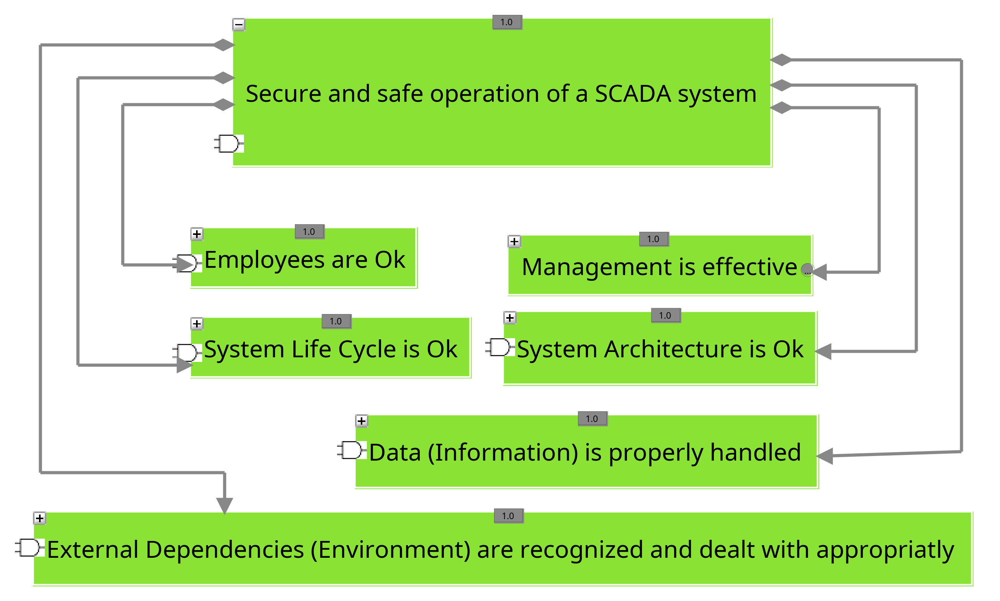

The dependency model developed by Cherdantseva et al. has already been transferred by Shaked et al. into the representation form of the FRIPP approach, with the top hierarchy level of the model shown in Figure 1.
As illustrated in the figure, the model includes not only technical but also organizational and external dependencies that occur when operating a SCADA system in critical infrastructure [[Che+22](https://www.mdpi.com/2076-3417/12/10/4880)].
However, these non-technical dependencies are not considered in this research, and thus the dependencies of the element "System Architecture is OK" are examined in more detail, with their dependencies depicted in Figure 2.

##### Figure 2: Dependencies of the System Architecture according to Cherdantseva et al.
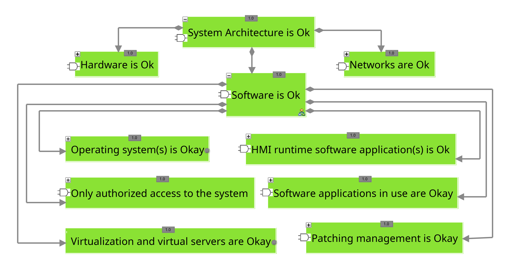

The dependencies of the system architecture are initially divided by Cherdantseva et al. into the hardware and software used, as well as the network components employed.
As our research does not deal with risks and dependencies in the hardware area, we will only consider the dependencies of the software used, which are also shown in Figure 2.
In this context, the dependencies of the software used are divided into many different dependency areas, ranging from virtualization platforms and operating systems to the "Human-Machine Interface" (HMI) [[Che+22](https://www.mdpi.com/2076-3417/12/10/4880)].
Again, an examination of the dependencies in the mentioned areas would be outside the focus of our work, so only the area "Software applications in use are Okay" is considered in more detail.
Specifically, this point reflects the dependencies in the Kubernetes area according to the understanding of this work and is therefore referred to as "Kubernetes-Cluster is Okay" in the following.
At this point, it should be mentioned that in the context of Kubernetes clusters, the aspect "Only authorized access to the system" is mainly represented by the authentication mechanisms integrated into the API server, the key value store, and the Kubelet, which is why this dependency is indirectly considered in the dependency model used for the evaluation.

##### Figure 3: Dependencies of the Software Applications in use according to Cherdantseva et al.
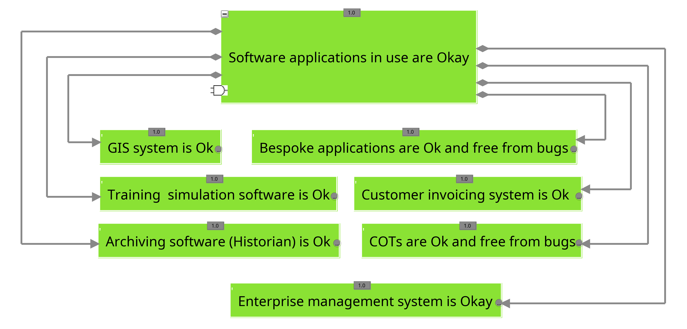

The dependencies identified by Cherdantseva et al. for the element "Software applications in use are Okay" for SCADA systems can be found in Figure 3.
However, as the focus of this work is on the dependencies of Kubernetes, the originally intended dependencies have been superseded by the dependencies of a typical Kubernetes cluster comprising three master and worker nodes.
The dependencies associated with an exemplary Kubernetes cluster can be found in Figure 4.
For the sake of clarity, the dependencies below the worker and master nodes have been excluded from Figure 4.
As the dependencies are identical for all nodes, they can be found in Figures 5 and 6, which show the dependencies of the first master and worker node, respectively.
The depicted dependencies are based on a highly available Kubernetes cluster comprising three nodes each for the control and data plane, as well as a stacked etcd component.
At this point, it should be noted once more that the Figure only represents the principal dependencies of the aforementioned Kubernetes cluster for reasons of clarity.
In the context of the representation, the term "is functional" as part of the labelling of individual dependencies signifies that only one of the described sub-elements must be operational to ensure the function of the next higher element.
This is also evident from the 'or' connection, represented by unfilled arrowheads [[Sha+23](https://doi.org/10.1016/j.cose.2023.103454)].
In contrast, the phrase "is okay" or "are okay" denotes an 'and' connection, whereby all dependencies must be fully met to ensure the functionality of the respective element [[Sha+23](https://doi.org/10.1016/j.cose.2023.103454)].
It should be stated that network plugins are typically operated as pods on each node, and thus are dependent on the data plane [[The24d](https://docs.cilium.io/en/stable/network/kubernetes/concepts/)].
Nevertheless, the FRIPP representation form is unable to accommodate such double dependencies [[Sha+23](https://doi.org/10.1016/j.cose.2023.103454);[SCB22](https://doi.org/10.1145/3538969.3538976)], and thus requires adjustment in future developments of the FRIPP approach.
In addition to the master and worker nodes, the dependency model also describes the dependencies of the workloads operated in Kubernetes, which are only considered secondarily below.
For the operation of the workloads, the container images and registries used, as well as the application  code and application configuration, must be fully functional.
The latter refers to the configuration of the Kubernetes objects necessary for the operation of the application.
Furthermore, the symbol '1.0', located above each node, denotes the extent to which the respective element is operational, with a scale ranging from 0.0 to 1.0.
However, Shaked et al. propose a more streamlined representation that exclusively encompasses the utilisation of fully functional elements (1.0) and non-functional elements (0.0), that is explained in the following section [[Sha+23](https://doi.org/10.1016/j.cose.2023.103454)], which we have also employed for our purposes.

##### Figure 4: Dependencies of a sample Kubernetes cluster based on the dependency model proposed by  Cherdantseva et al.

##### Figure 5: Dependencies of the worker nodes besed on the dependency model proposed by  Cherdantseva et al.
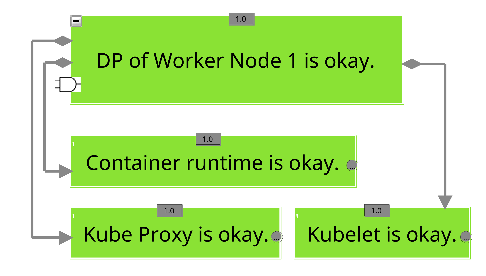

##### Figure 6: Dependencies of the master nodes besed on the dependency model proposed by  Cherdantseva et al.
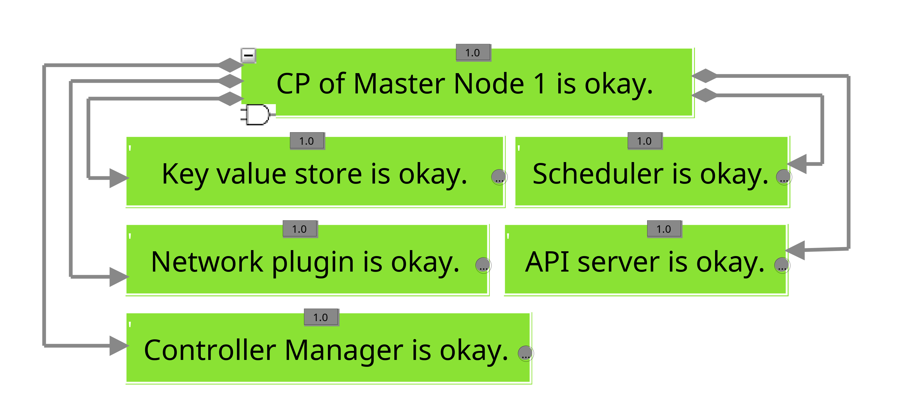

## Formalised Response to Incidents Process Playbook (FRIPP) Approach

In general, the components of an incident response playbook can be broadly classified into four key categories [[Sch+23](https://doi.ieeecomputersociety.org/10.1109/SP54263.2024.00060)].
Schlette et al. define an incident response playbook as comprising general *meta information*, predefined *parameters*, a systematic *workflow* and some additional *features*, the majority of which are unique to the specific representation  [[Sch+23](https://doi.ieeecomputersociety.org/10.1109/SP54263.2024.00060)].
The following sections describe the extent to which the "Formalised Response to Incidents Process Playbook" (FRIPP) [[SCB22](https://doi.org/10.1145/3538969.3538976)] approach by Shaked et al. implements the four aforementioned components.
It is important to note that the FRIPP approach utilizes a combination of graphical and text-based representations (see Fig. 7).
Furthermore, the FRIPP approach represents a significant advancement in the description of incident response playbook structures through scientific methods, employing a formally defined modelling approach with scientific foundations [[SCB22](https://doi.org/10.1145/3538969.3538976)].

##### Figure 7: Exemplary Representation of an Incident Response Playbook using the FRIPP Approach according to Shaked et al.
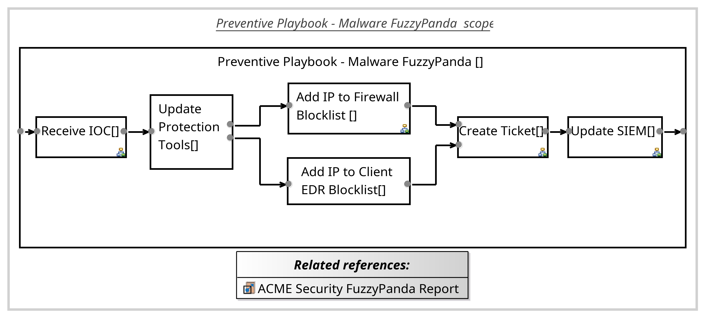

### General Meta Information

In order to facilitate the long-term use of incident response playbooks, it is necessary to provide context information, as is the case with any document of this nature.
This encompasses general information, such as the author and version of the playbook, as well as supplementary details, including release information and the identity of the responsible parties [[Sch+23](https://doi.ieeecomputersociety.org/10.1109/SP54263.2024.00060);[SCP21](https://doi.org/10.1109/COMST.2021.3117338)].
Furthermore, descriptive elements, such as the name or a unique identification number, constitute an integral part of the context information associated with an incident response playbook [[Sch+23](https://doi.ieeecomputersociety.org/10.1109/SP54263.2024.00060)].

In the case of the FRIPP approach, supplementary context information can be stored in conjunction with the aforementioned general information and descriptive elements [[SCB22](https://doi.org/10.1145/3538969.3538976)].
In particular, this encompasses the referencing of other documents and the potential for hierarchical integration of supplementary playbooks [[SCB22](https://doi.org/10.1145/3538969.3538976);[SCP21](https://doi.org/10.1109/COMST.2021.3117338)].
References to external documents are represented in the "Related references" section within the FRIPP representation (see Fig. 7), while  the referencing of additional playbooks is indicated by the diagram symbol in the lower right corner of a step [[SCB22](https://doi.org/10.1145/3538969.3538976)].
Consequently, a further incident response playbook can be associated with each step, delineating the step's execution, and the referenced playbooks can be readily accessed in the [SecMoF](https://github.com/CardiffUniCOMSC/SecMoF) modelling platform with a straightforward double-click [[Sha+23](https://doi.org/10.1016/j.cose.2023.103454)].

### Predefined Parameters

In addition to the previously presented meta information, certain parameters are required for the execution of the playbook or are passed on to subsequent procedures after the described procedure is completed [[Sch+23](https://doi.ieeecomputersociety.org/10.1109/SP54263.2024.00060)].
It is thus possible to differentiate between the parameters that must be provided in advance of the described playbook and those that are generated as a direct consequence of its execution [[Sch+23](https://doi.ieeecomputersociety.org/10.1109/SP54263.2024.00060)].
In this manner, it is possible to define in advance which situation-dependent information is required for the successful execution of the playbook.
This allows for the potential information sources to be identified in advance and accessed rapidly when necessary.
Moreover, the explicitly defined results clarify which information and artifacts must be available upon the complete execution of the incident response playbook.
This enables the identification of a defined conclusion to the continuous cycle of analysis and response measures, thus clearly defining the end of an incident.

The FRIPP approach allows the implementation of parameters through the definition of unique artifacts that must reach a specified state before the next procedure step can be carried out [[SCB22](https://doi.org/10.1145/3538969.3538976)].
It facilitates the definition of such parameters not only at the commencement or conclusion of the incident response playbook, but also at the level of individual steps [[SCB22](https://doi.org/10.1145/3538969.3538976)].
These artefact definitions alongside every step simultaneously implement the logic for transitioning to the next step [[SCB22](https://doi.org/10.1145/3538969.3538976)].
Furthermore, the FRIPP representation allows for the incorporation of textual descriptions at the transition points between steps [[SCB22](https://doi.org/10.1145/3538969.3538976)].
While this may result in complications when automating playbook applications, these descriptions provide a transparent pathway for users to access supplementary information.
It is therefore appropriate to utilise these textual descriptions to provide a more detailed account of the definition of the artefacts and their states, thus facilitating a more comprehensive understanding [[SCB22](https://doi.org/10.1145/3538969.3538976)].

### Systematic Workflow

All previously described context elements are, however, redundant without the central workflow, as it determines the sequence of individual steps and thus functions as the core of any playbook [[Sch+23](https://doi.ieeecomputersociety.org/10.1109/SP54263.2024.00060)].
The described procedure varies greatly in terms of complexity and scope [[Sch+23](https://doi.ieeecomputersociety.org/10.1109/SP54263.2024.00060)].
Abstract playbooks often contain only linear sequences without major branches, while practical playbooks frequently exhibit more complex structures in conjunction with a multitude of individual steps [[Sch+23](https://doi.ieeecomputersociety.org/10.1109/SP54263.2024.00060)].

Within the FRIPP approach, the workflow is represented as a sequence of individual steps, which are connected both graphically and logically through artifact definitions [[SCB22](https://doi.org/10.1145/3538969.3538976);[SCP21](https://doi.org/10.1109/COMST.2021.3117338)]. This makes it possible to clearly define the sequence of steps for both automated and manual application of the playbook.
Specifically, within the FRIPP representation, each step is individually defined by specifying an action type, indicating whether it is to be executed manually or automatically [[SCB22](https://doi.org/10.1145/3538969.3538976)].
At the same time, the actor responsible for executing the step can be specified [[SCB22](https://doi.org/10.1145/3538969.3538976);[SCP21](https://doi.org/10.1109/COMST.2021.3117338)].
The actor is indicated in square brackets after the title of the respective step, although Figure 7 does not contain any actor information, as the reference used by Shaked et al. for creating the example does not include explicit details on this [[SCB22](https://doi.org/10.1145/3538969.3538976);[OAS21](https://docs.oasis-open.org/cacao/security-playbooks/v1.0/cs02/security-playbooks-v1.0-cs02.html#_dv8z62zhr1ap)].

As a result, a step always represents a combination of actor, action, and artifact, with the actions defining how the respective artifact has to be brought to the corresponding target state by the actor in order to ultimately proceed to the next step [[Sch+23](https://doi.ieeecomputersociety.org/10.1109/SP54263.2024.00060);[SCP21](https://doi.org/10.1109/COMST.2021.3117338)].
These steps thus describe various measures and also contain the underlying logic for controlling the workflow [[Sch+23](https://doi.ieeecomputersociety.org/10.1109/SP54263.2024.00060)].
This means that each step can be assigned a predecessor and successor, with complex structures such as repetitions or parallel sequences arising from the inclusion of additional conditions [[Sch+23](https://doi.ieeecomputersociety.org/10.1109/SP54263.2024.00060)].
Furthermore, each step has its own context information, including a unique identifier [[Sch+23](https://doi.ieeecomputersociety.org/10.1109/SP54263.2024.00060)], which can be found in the "Properties" section of the modeling platform.

Additionally, as previously mentioned, within the FRIPP representation, a single step can refer to another playbook, creating a multi-level hierarchy that can be used to assign multiple measures to a higher-level step.
The subordinate playbooks shown in Fig. 8 thus complete the playbook shown in Fig. 7 by explicitly detailing the measures necessary for implementing a higher-level step, resulting in the overall view of the playbook.

##### Figure 8: Subordinate Playbooks to Complement the Exemplary FRIPP Representation in Figure 7
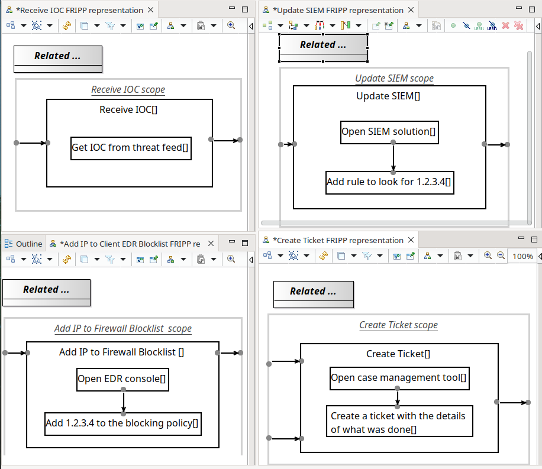

### Additional Features

In addition to the previously presented workflow, incident response playbooks typically comprise a number of additional features, which may vary depending on their representation [[Sch+23](https://doi.ieeecomputersociety.org/10.1109/SP54263.2024.00060)].
Potential additional features may include the option of validating source code-based playbooks and supplementary information regarding the prioritization of incidents and measures.

In the context of the FRIPP approach, there are additional features beyond those already presented, including the possibilities for internal and external referencing.
It is particularly noteworthy that the FRIPP approach has been extended by Shaked et al. to encompass considerations of the business impact of response measures, as proposed in their research [[Sha+23](https://doi.org/10.1016/j.cose.2023.103454)].
This development enhances the FRIPP representation with a dependency model of the affected infrastructure (see Figure 9), thereby enabling the precise depiction of the impact of a measure on the operation of the respective organization [[Sch+23](https://doi.ieeecomputersociety.org/10.1109/SP54263.2024.00060)].
In their research, Shaked et al. adopt the approach developed by Cherdantseva et al. [[Che+22](https://doi.org/10.3390/app12104880)] for depicting dependencies within a technical infrastructure and link it with the FRIPP approach [[Sha+23](https://doi.org/10.1016/j.cose.2023.103454)].
Accordingly, the playbook illustrated in Figure 7 could be enhanced with an illustrative dependency model, thereby facilitating the visual representation of the business impact of individual measures through corresponding links (see Figure 9).

In this particular instance, the blocking of a public IP address has a direct impact on the accessibility of external networks, ultimately leading to the complete non-functionality of the entire system, as indicated by the red colouring of the central element, which reads "System is fully functional."
Moreover, Shaked et al. introduce a metric, designated as the "Change in Operations" (CiO), to quantify the business impact.
This metric reflects the extent to which a specific measure affects each element within the dependency model, with values directly readable based on the red (0) or green (1) colouring of the elements.
In theory, it would be possible to cover individual intermediate states between the non-functional (red) and functional (green) states.
However, this is not applied by Shaked et al. for the purpose of better representing the business impacts [[Sha+23](https://doi.org/10.1016/j.cose.2023.103454)].

##### Figure 9: Additional dependency model added to the Exemplary FRIPP Representation in Figure 7 according to Shaked et al.
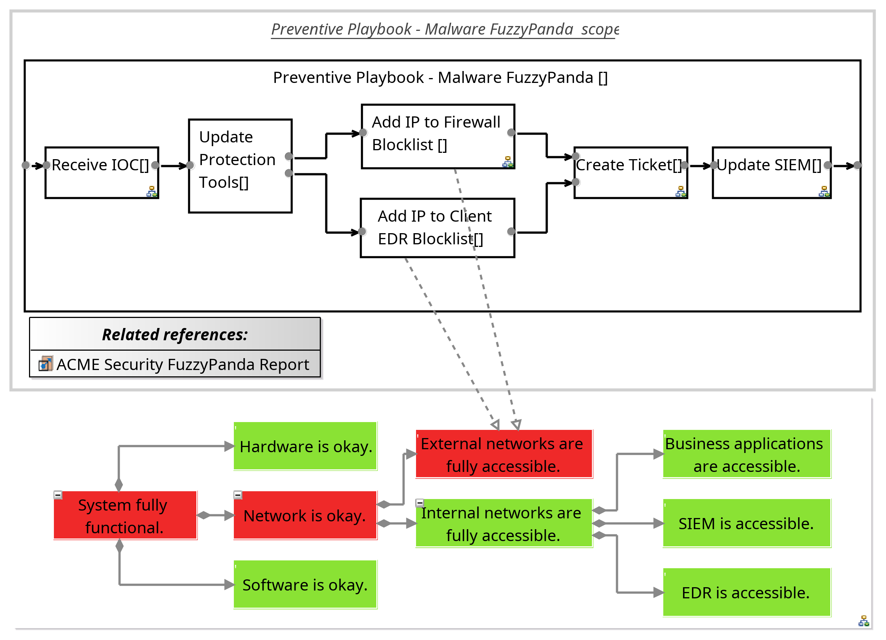

## Description of the developed Incident Response Playbook

The following presents a description of the implementation of the aforementioned measures into a coherent incident response playbook for responding to cryptojacking attacks on Kubernetes.
For the creation of the playbook, the FRIPP approach by Shaked et al. was used.
The FRIPP approach was selected for its ability to provide an initial scientific basis for the creation of incident response playbooks that consider the business impact of the included measures and simultaneously allow for a multi-stage implementation of the playbooks.
This is a necessary step, as the measures have been structured according to the reactive phases of the incident response process as defined by NIST [[Cic+12](http://dx.doi.org/10.6028/NIST.SP.800-61r2)].
Based on this process, the fundamental structure of the incident response playbook, as illustrated in Figure 10, is finally established.
This structure comprises two distinct elements, which represent the continuous alternation between analysis and reaction measures.

It should be noted at this point that not all the presented measures can be implemented in every Kubernetes cluster, which is not further considered here, as the playbook is created independently of internal organizational infrastructures.
Consequently, when the playbook is transferred into an internal organizational incident response playbook, any measures that cannot be implemented in the context of the respective infrastructure must be replaced or removed.
Similarly, each step of the playbook is defined as a manual action, given that the playbook is implemented independently of SOAR platforms or similar.
Therefore, there is no possibility of automated execution of the respective action.
Additionally, an adaptation of the playbook to the specific conditions of the respective organization is necessary.
Furthermore, it should be mentioned that organizational aspects, such as the planning of suitable times for the execution of remediation and recovery measures [[MPM14](http://cisweb.bristolcc.edu/~ik/Download/Forensic/Incident_Response_Computer_Forensics_3rd_Edition.pdf), p.620ff], must be considered when implementing the incident response playbook, but are not further considered here due to the focus of this work.

##### Figure 10: Fundamental Structure of the Developed Playbook Based on the FRIPP Approach

A total of seven analysis measures were proposed in the [respective subfolder](../measures/analysis_measures/), almost all of which received a good overall rating.
However, measure A-P-01 is not considered further here due to its inadequate overall rating.
The remaining six measures were organized in a logical sequence (see Figure 11), with the order being primarily based on the overall evaluation of the measures.
However, the sequence was not determined without further considerations.
Instead, the analysis measures that maintain the status of the cluster and, at the same time, provide an initial overview of the state of the Kubernetes cluster with minimal resource expenditure were listed first.
Accordingly, the creation of a cluster overview (A-N-01) with an overall rating of 4.25 and the export of the cluster status (A-F-01) with an overall rating of 4.00 were positioned at the beginning of the analysis phase.
The remaining analysis measures were then ordered in descending order of their overall rating.
In the event of equal ratings, the measures were ordered according to their applicability and complexity.
This sorting was selected because all measures have a minimal business impact, and therefore the probability of implementation and the required resources are readily apparent as a basis for structuring.
While it is optimal to perform all analytical measures, the subsequent stage should be initiated when sufficient evidence suggests the presence of a true positive and a response is necessary to limit potential damage.
In the course of this, the analysis measures are prioritized in accordance with their sequence, with the complexity of the measures increasing towards the end as the overall rating is decreasing.
This is due to the absence of clear artefacts and indicators of compromise for the respective incident, which would otherwise allow for the implementation of simple measures.

##### Figure 11: Analysis Phase of the Incident Response Playbook Developed Based on the FRIPP Approach
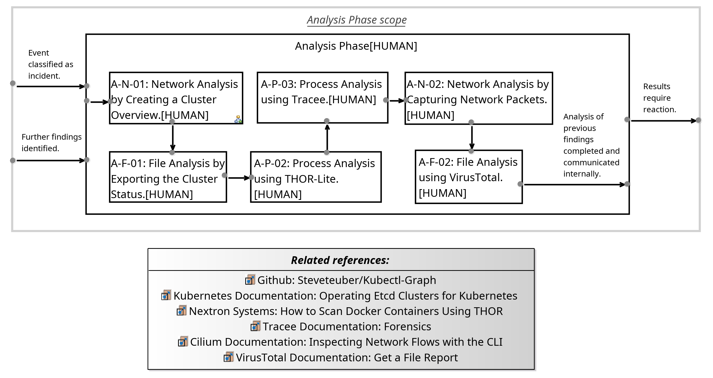

Once the requisite data regarding the incident has been gathered through the previously outlined analysis measures and any new findings have been incorporated into an overview of the situation, the implementation of suitable containment measures should be initiated without delay, given the availability of the requisite human resources.
In this context, the prioritization of incidents should be discussed, but as this is one of the organizational measures that has already been discussed in other works, it will not be elaborated upon further here.

Apart from this, when implementing initial containment measures, it is of particular importance that these can be implemented promptly.
Therefore, it is preferable to implement short-term response measures with a higher business impact immediately, rather than waiting for a longer response time [[MPM14](http://cisweb.bristolcc.edu/~ik/Download/Forensic/Incident_Response_Computer_Forensics_3rd_Edition.pdf), pp. 611ff].
In light of the aforementioned considerations, the short-term measures were initially prioritized within the context of the containment phase.
However, should circumstances permit, these measures could subsequently be superseded by a long-term measure.
The short-term and long-term containment measures were sorted separately according to their overall ratings and included in the incident response playbook.
However, the measures were not situated directly within the second element depicted in Figure 10.
Instead, an additional layer of abstraction was introduced between these two layers, as illustrated in Figure 12, which also includes the associated dependency model.
This intermediate level is necessary in order to facilitate a clear mapping of the continuous change between analysis and response measures, which is based on continuous monitoring of the cluster by internal organizational detection measures.
Based on this, the containment measures were placed in the context of the containment phase, as illustrated in Figure 13.

##### Figure 12: Combination of the Reactive Phases of the Developed Playbook
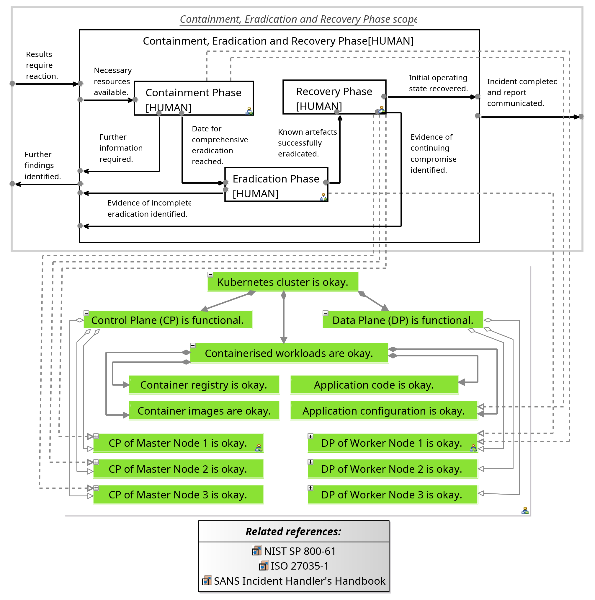

##### Figure 13: Containment Phase of the Incident Response Playbook Developed Based on the FRIPP Approach
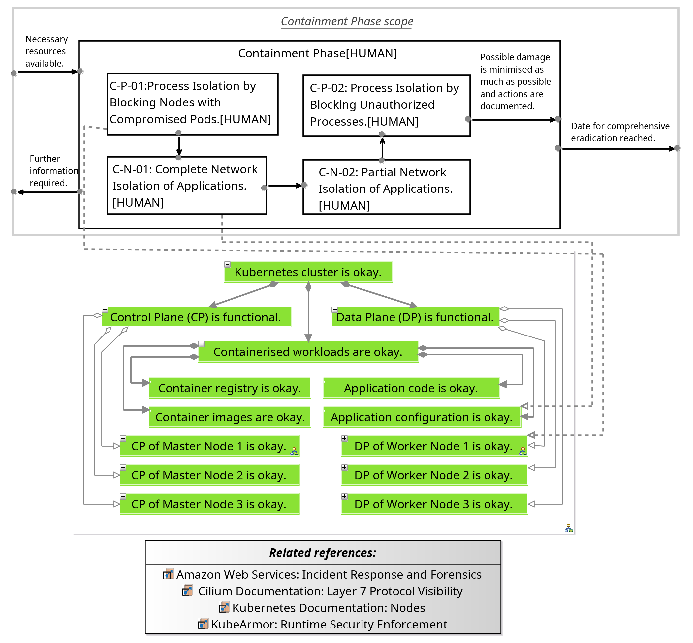

Once the cryptojacking incident has been successfully contained, it is imperative that all artefacts left behind by the attackers be removed and that the compromised systems be cleaned up to the greatest extent possible.
This is necessary so that the original operating state can then be restored.
In order to achieve this objective, a total of five distinct measures were put forth in the [respective subfolder](../measures/eradication_measures/).
These eradication measures were designed to prevent the attackers from actively accessing the cluster and to remove the malware that had been left behind within the cluster.
It is important to note that these measures should not be implemented in a consecutive manner as soon as a new attacker artefact has been identified.
As illustrated in Figure 14, the requisite eradication measures should be assembled in order to eliminate all attacker access to the cluster in a single, planned operation [[MPM14](http://cisweb.bristolcc.edu/~ik/Download/Forensic/Incident_Response_Computer_Forensics_3rd_Edition.pdf), pp. 615ff].
This is necessary because the attackers will attempt to regain access to the cluster while the eradication measures are being carried out.
A longer eradication phase provides the attackers with additional opportunities to restore or expand their access to the cluster.
Consequently, the potential damage should be mitigated by promptly implementing feasible eradication measures and subsequently identifying the comprehensive extent of the compromise.
This allows for the removal of all access points and residual artefacts in a single, comprehensive operation.
It bears repeating, however, that before the eradication measures are implemented, it is imperative to ascertain whether all pertinent information regarding the incident has been retained and the relevant artefacts have been securely stored externally.

Subsequently, the efficacy of the eradication measures should be verified through the implementation of detection measures to ascertain the complete removal of the identified artefacts and access points.
In the event that indications of incomplete removal emerge, it is imperative to conduct further analysis in order to investigate the remaining compromise in greater detail and initiate a subsequent response.
In the absence of further indications of a continuing compromise, the subsequent step is to restore the systems, ensuring that comprehensive documentation and communication of the measures taken are provided.
As illustrated in Figure 14, these elements were incorporated into the eradication phase of the playbook.
In order to structure the measures, they have been sorted in descending order according to their overall rating, although the measures to be implemented will need to be selected in the context of the particular incident.
However, if there is any doubt as to the complete identification of the extent of the compromise, it is recommended that all measures be fully implemented, taking into account the impact of the measures on the operational status.

##### Figure 14: Eradication Phase of the Incident Response Playbook Developed Based on the FRIPP Approach

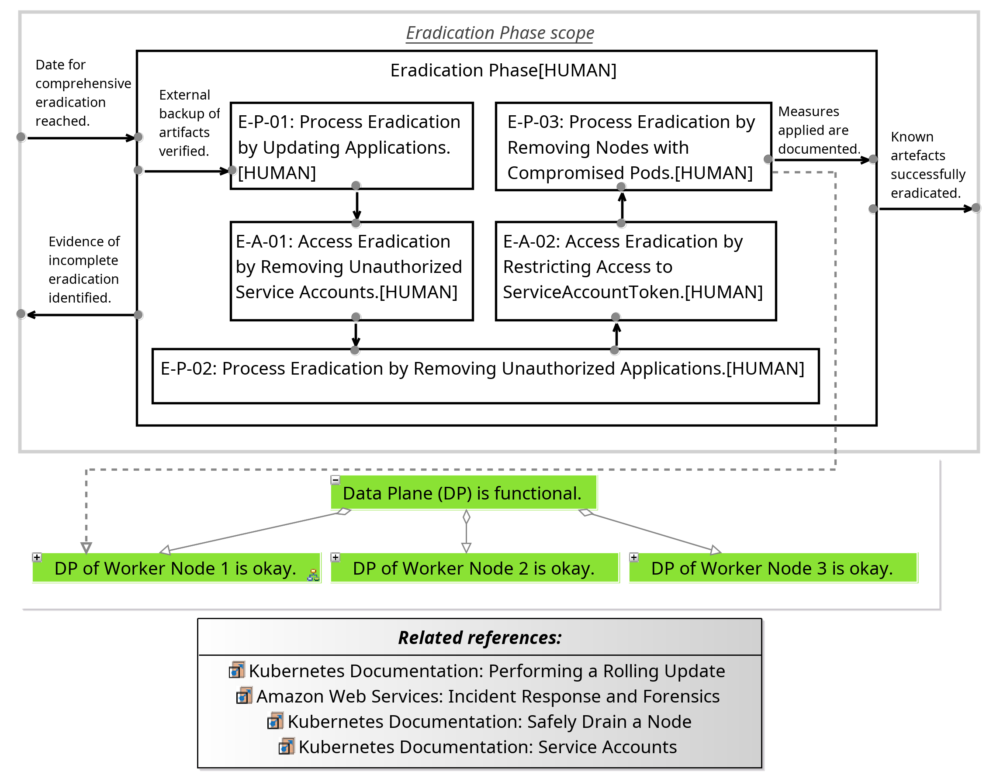

Following the successful implementation of the eradication measures, it is crucial to restore the operational state to its prior condition as closely as possible without exposing the Kubernetes cluster to a new compromise.
This can be achieved by following the sequence of measures illustrated in Figure 15.
In the event that a backup copy of the key value store is available for restoring the cluster, and it can be explicitly ruled out that the cryptojacking incident was already in progress at the time of creation, the restoring of this backup copy can be used to reconstruct the original operating state.
Furthermore, this approach has the benefit of removing any additional, previously undetected alterations to the cluster.
For this reason, measure R-O-01 was placed separately from the other three recovery measures in the recovery phase.
However, it is essential to ensure that all measures carried out in the interim to secure the cluster are reapplied after the key value store has been restored.
In the absence of a backup copy, the original operating state can be restored following the successful removal of the artefacts through the application of the remaining three measures.
The measures were also prioritized based on their overall rating and applicability.

It is recommended that, regardless of the recovery strategy employed, the Kubernetes cluster be monitored in parallel and that explicit searches be conducted for indications of a renewed or ongoing compromise.
This should be done even in the absence of compelling evidence that the restored cluster has been successfully compromised, as attackers frequently attempt to reacquire access to systems they have previously compromised [[MPM14](http://cisweb.bristolcc.edu/~ik/Download/Forensic/Incident_Response_Computer_Forensics_3rd_Edition.pdf), p. 615].
Once the original operating state has been restored, additional measures must be taken to address the cryptojacking incident.
These include a final meeting to collect all findings and opportunities for improvement, as well as the publication of the final report in a selected network of trusted partner organizations.
However, a more detailed view of these internal organizational measures must be carried out in future research.

##### Figure 15: Recovery Phase of the Incident Response Playbook Developed Based on the FRIPP Approach

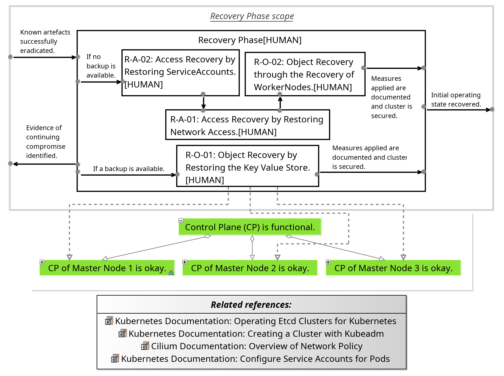

## Setting Up the Incident Response Playbook

- The representation of the incident response playbook is based on the FRIPP approach and the associated modeling platform [SecMoF](https://github.com/CardiffUniCOMSC/SecMoF), developed by Cardiff University.
  - All details regarding the setup of SecMoF can be found in the [official documentation of the modeling platform](https://github.com/CardiffUniCOMSC/SecMoF/tree/main/Documentation).
- After successfully setting up the modeling platform, the incident response playbook can be opened. To do this, the existing repository must be cloned, and the entire directory must be opened as a workspace in the modeling platform.
  - Further information can be found in the [Select Workspace](https://github.com/CardiffUniCOMSC/SecMoF/tree/main/Documentation#5-select-workspace) section of the official documentation.
  - Some error messages may occur, which can be ignored as they are due to the prototype stage of the modeling platform.
- In the next step, the incident response playbook developed and therefore the associated project must be imported.
  - Further information can be found in the [Import Example Project](https://github.com/CardiffUniCOMSC/SecMoF/tree/main/Documentation#6-import-example-project) section of SecMoF’s official documentation.

## Using the Incident Response Playbook
- After successfully importing the incident response playbook, it can be used interactively. The FRIPP representation of the playbook must be opened for this.

- From there, both the dependency model and the individual phases of the incident response playbook can be accessed via double-click or the context menu.
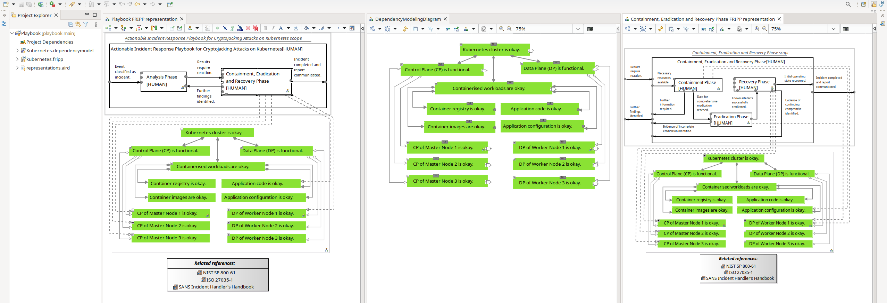

- For interactive use of the Business Impact representation, individual elements of the FRIPP representation can be marked as complete to simulate the effects. The impacts will be updated beyond the context of the current view.
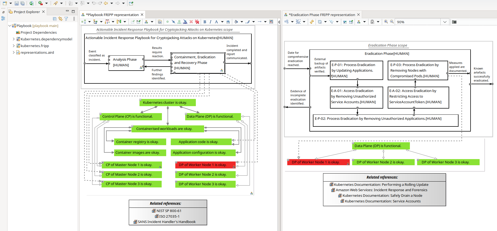

## Notes

- The included incident response playbook was developed as part of a scientific work and is not yet fully mature. As mentioned in the paper, the measures included in the playbook should be evaluated in a more comprehensive environment, and additional measures should be integrated before practical use.
- The following references were used in the development of the source code:
    - https://github.com/CardiffUniCOMSC/SecMoF/tree/main/Documentation
    - https://dl.acm.org/doi/10.1145/3538969.3538976
    - https://doi.org/10.1016/j.cose.2023.103454

